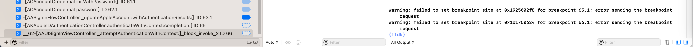
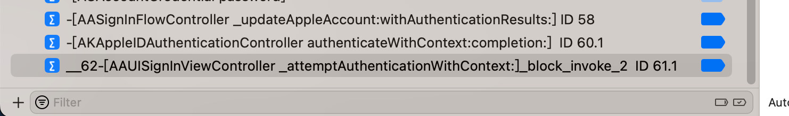

# 常见问题

## 条件判断断点

### Couldn't parse conditional expression error user expression has unknown return type cast the call to its declared return type

#### 0 == strcmp($arg1, "/usr/lib/libsubstitute.dylib")

* 问题

XCode的lldb中，加断点的条件判断：

```bash
0 == strcmp($arg1, "/usr/lib/libsubstitute.dylib")
```
  * 

报错：

```bash
Stopped due to an error evaluating condition of breakpoint 10.2: "0 == strcmp($arg1, "/usr/lib/libsubstitute.dylib")"
Couldn't parse conditional expression:
error: <user expression 7>:1:6: 'strcmp' has unknown return type; cast the call to its declared return type
0 == strcmp($arg1, "/usr/lib/libsubstitute.dylib")
     ^~~~~~~~~~~~~~~~~~~~~~~~~~~~~~~~~~~~~~~~~~~~~
```

* 原因

此处无法识别`strcmp`的返回值类型`size_t`

注：`size_t`本身一般是`unsigned int`或`unsigned long`

* 解决办法

加上强制转换，为普通的int类型：

```bash
0 == (int)strcmp($arg1, "/usr/lib/libsubstitute.dylib")
```
  * 

#### 判断objc_alloc_init中+44行的汇编代码中参数是否是AADeviceInfo的实例

* 写法1：`(bool)[$x0 isKindOfClass: objc_getClass("AADeviceInfo")]`

之前经过`lldb`命令测试发现`objc_getClass`返回的结果类型无法识别：

```bash
(lldb) po [$x0 isKindOfClass: objc_getClass("AADeviceInfo")]
error: expression failed to parse:
warning: <user expression 25>:1:2: receiver type 'unsigned long' is not 'id' or interface pointer, consider casting it to 'id'
[$x0 isKindOfClass: objc_getClass("AADeviceInfo")]
 ^~~
error: <user expression 25>:1:21: 'objc_getClass' has unknown return type; cast the call to its declared return type
[$x0 isKindOfClass: objc_getClass("AADeviceInfo")]
```

所以最后要改为：

```bash
(bool)[$x0 isKindOfClass: (Class)objc_getClass("AADeviceInfo")]
```

才至少确保语法上是正确的（至少po可以正常解析执行）

```bash
(lldb) po [$x0 isKindOfClass: (Class)objc_getClass("AADeviceInfo")]
 nil
```

* 写法2：`[$x0 isKindOfClass: (Class)objc_getClass("AADeviceInfo")]`

表达式最前面没有加上bool强制转换，所以Xcode无法识别（是条件判断类型的语句）

* 写法3：`(bool)[NSStringFromClass($x0) isEqualToString: @"AADeviceInfo"]`
  * 此处已经是`AADeviceInfo`的`Instance`，而不是`Class`，所以不能用`NSStringFromClass`
    * 因为函数定义是：
      * `NSString * NSStringFromClass(Class aClass);`
    * `NSStringFromClass`的参数，应该是`Class`，而非`Instance`
  * 详见：
    * 【已解决】iOS的ObjC中如何获取Class类名

## iOS的ObjC相关

### WARNING:  Unable to resolve breakpoint to any actual locations

* 问题

`lldb`中给`ObjC`函数加断点：

```bash
br s -n "-[NSMutableURLRequest setValue:forHTTPHeaderField:]"
```

报错：`WARNING:  Unable to resolve breakpoint to any actual locations.`

* 直接原因

当前被调试的二进制中，的确没有这个类的函数，可供加断点，所以报错。

* 深层次原因

此处的被lldb调试的对象，iOS的app：`Preferences`（或者是此刻iOS中系统的库），是没有包含调试的信息的，或者是经过特殊处理了，去掉了可以调试的信息

导致此处ObjC的类的函数：

`-[NSMutableURLRequest setValue:forHTTPHeaderField:]`

内部找不到，所以就加不上断点。

* 解决办法：没法解决
* 规避办法

此处特殊的，可以去找：其他的，个别的，继承了该类的函数，去加断点

比如：

```bash
image lookup -rn "setValue:forHTTPHeaderField:"
```

找到的部分类，有此函数，所以可以去加断点：

```bash
br s -n "-[SSMutableURLRequestProperties setValue:forHTTPHeaderField:]"
```

## 其他

### warning: failed to set breakpoint site at 0x1b1750624 for breakpoint 66.1: error sending the breakpoint request

* 问题

Xcode中加断点时报错：

```bash
warning: failed to set breakpoint site at 0x1b1750624 for breakpoint 66.1: error sending the breakpoint request
```



* 原因：调试环境被破坏了
  * 细节：之前Mac中，正常用Xcode调试USB连接的iPhone设备中的内容，但是后来，关闭了Mac屏幕，内部应该就是去休眠了
    * 所以会导致Mac中和iPhone中部分程序已休眠，或者是停止运行，断开连接等异常情况
    * 所以即使重新打开Mac屏幕，重新继续去Xcode中去调试，此时环境也不对了，被破坏了，所以会出现各种异常情况
* 解决办法
  * 重新用Mac连接iPhone，加上Xcode去，重新启动调试环境，即可正常继续调试：添加断点等等
    * 
