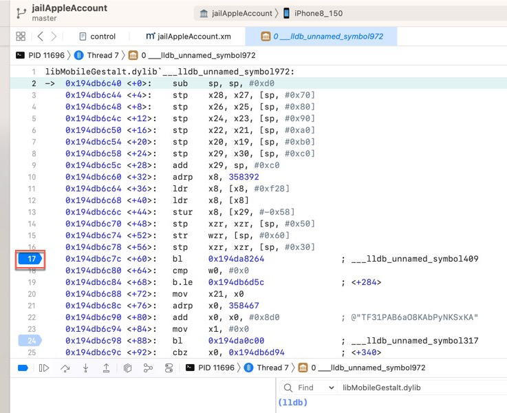

# 常见问题

## Xcode断点

### 给当前行加断点却看不到

Xcode中的汇编代码加断点后，默认改行左边会显示蓝色底色，表示加了断点了：

比如：



但是，当给，调试时函数调用堆栈中，上层某层函数的汇编代码的下一行将要执行的汇编代码，去加断点时，结果：

点击了左边的空白处，但是：没有出现（表示断点添加成功的）蓝色底色：


以为是：没有成功（给该行汇编代码）加上断点

其实就是没有成功添加断点，且

* 是无法给该行（断点时，上层某函数的，将要执行的下一行汇编代码）加上断点的
  * 因此：此时右键该行左边空白处，是看不到=无法出现右键菜单的
    * 对比：其他普通已经加上断点的地方出现的，右键是可以出现，编辑断点、删除断点等功能的右键菜单的

## Xcode设置

### was compiled with optimization - stepping may behave oddly; variables may not be available

* 问题

Xcode中编译的iOSOpenDev的dylib插件，去调试时，右下角调试窗口输出警告信息：

`jailAppleAccount.dylib was compiled with optimization - stepping may behave oddly; variables may not be available.`


* 原因

Xcode在编译代码时（默认就）启用了优化：

`Xcode`->`Targets`->`xxx`->`Build Settings`->`Apple Clang - Code Generation`->`Optimization Level`中的`Release`，默认是：`Fastest, Smallest [-Os]`

含义是：程序尽可能的快，文件尽可能的小。

涉及到的内部优化，就可能会把部分调试相关内容优化去掉，从而可能导致调试时出现上述的现象：

* stepping may behave oddly
  * 单步（进入或跳过）调试时，会出现奇怪的现象
    * 因为部分代码可能被优化掉了
      * 从而该代码单步执行可能执行不到，或者和源码对不上
* variables may not be available
  * 部分变量可能会被优化掉

* 解决办法：去掉优化，保留调试信息
* 具体步骤：
  * 把上述中，`Release`的`Optimization Level`的值改为`None [-O0]`
    * 图
      * 
      * 
    * 表示：不（做任何）优化
      * 从而保留了调试信息
        * 后续
          * 单步调试就正常了，和代码对得上了
          * 变量值也不会丢失了

## 条件判断断点

### Couldn't parse conditional expression error user expression has unknown return type cast the call to its declared return type

#### 0 == strcmp($arg1, "/usr/lib/libsubstitute.dylib")

* 问题

XCode的lldb中，加断点的条件判断：

```bash
0 == strcmp($arg1, "/usr/lib/libsubstitute.dylib")
```
  * 

报错：

```bash
Stopped due to an error evaluating condition of breakpoint 10.2: "0 == strcmp($arg1, "/usr/lib/libsubstitute.dylib")"
Couldn't parse conditional expression:
error: <user expression 7>:1:6: 'strcmp' has unknown return type; cast the call to its declared return type
0 == strcmp($arg1, "/usr/lib/libsubstitute.dylib")
     ^~~~~~~~~~~~~~~~~~~~~~~~~~~~~~~~~~~~~~~~~~~~~
```

* 原因

此处无法识别`strcmp`的返回值类型`size_t`

注：`size_t`本身一般是`unsigned int`或`unsigned long`

* 解决办法

加上强制转换，为普通的int类型：

```bash
0 == (int)strcmp($arg1, "/usr/lib/libsubstitute.dylib")
```
  * 

#### 判断objc_alloc_init中+44行的汇编代码中参数是否是AADeviceInfo的实例

* 写法1：`(bool)[$x0 isKindOfClass: objc_getClass("AADeviceInfo")]`

之前经过`lldb`命令测试发现`objc_getClass`返回的结果类型无法识别：

```bash
(lldb) po [$x0 isKindOfClass: objc_getClass("AADeviceInfo")]
error: expression failed to parse:
warning: <user expression 25>:1:2: receiver type 'unsigned long' is not 'id' or interface pointer, consider casting it to 'id'
[$x0 isKindOfClass: objc_getClass("AADeviceInfo")]
 ^~~
error: <user expression 25>:1:21: 'objc_getClass' has unknown return type; cast the call to its declared return type
[$x0 isKindOfClass: objc_getClass("AADeviceInfo")]
```

所以最后要改为：

```bash
(bool)[$x0 isKindOfClass: (Class)objc_getClass("AADeviceInfo")]
```

才至少确保语法上是正确的（至少po可以正常解析执行）

```bash
(lldb) po [$x0 isKindOfClass: (Class)objc_getClass("AADeviceInfo")]
 nil
```

* 写法2：`[$x0 isKindOfClass: (Class)objc_getClass("AADeviceInfo")]`

表达式最前面没有加上bool强制转换，所以Xcode无法识别（是条件判断类型的语句）

* 写法3：`(bool)[NSStringFromClass($x0) isEqualToString: @"AADeviceInfo"]`
  * 此处已经是`AADeviceInfo`的`Instance`，而不是`Class`，所以不能用`NSStringFromClass`
    * 因为函数定义是：
      * `NSString * NSStringFromClass(Class aClass);`
    * `NSStringFromClass`的参数，应该是`Class`，而非`Instance`
  * 详见：
    * 【已解决】iOS的ObjC中如何获取Class类名

## iOS的ObjC相关

### WARNING:  Unable to resolve breakpoint to any actual locations

* 问题

`lldb`中给`ObjC`函数加断点：

```bash
br s -n "-[NSMutableURLRequest setValue:forHTTPHeaderField:]"
```

报错：`WARNING:  Unable to resolve breakpoint to any actual locations.`

* 直接原因

当前被调试的二进制中，的确没有这个类的函数，可供加断点，所以报错。

* 深层次原因

此处的被lldb调试的对象，iOS的app：`Preferences`（或者是此刻iOS中系统的库），是没有包含调试的信息的，或者是经过特殊处理了，去掉了可以调试的信息

导致此处ObjC的类的函数：

`-[NSMutableURLRequest setValue:forHTTPHeaderField:]`

内部找不到，所以就加不上断点。

* 解决办法：没法解决
* 规避办法

此处特殊的，可以去找：其他的，个别的，继承了该类的函数，去加断点

比如：

```bash
image lookup -rn "setValue:forHTTPHeaderField:"
```

找到的部分类，有此函数，所以可以去加断点：

```bash
br s -n "-[SSMutableURLRequestProperties setValue:forHTTPHeaderField:]"
```

### 给带Deprecated的函数名加断点加不上断点

之前试过给ObjC函数：

```bash
+[AADeviceInfo(Deprecated) udid]
```

去加断点，发现加不上

后来才知道，其实是：

* 之前没加上断点，是另外的原因
  * 调试目标和hook目标不一致
    * 具体解决办法，详见：[断点能加上且能触发](../note_summary/xcode/added_and_trigger.md)
* 此处能加上断点，用的函数名是不带`Deprecated`字眼的
  ```bash
  +[AADeviceInfo udid]
  ```
* 如果起查找函数，可以发现底层函数就是带`Deprecated`字眼的函数 = 真正触发时，Xcode中显示的也是带Deprecated字眼的函数
  ```bash
  (lldb) image lookup -vn "+[AADeviceInfo udid]"
  1 match found in /Users/crifan/Library/Developer/Xcode/iOS DeviceSupport/15.0 (19A346)/Symbols/System/Library/PrivateFrameworks/AppleAccount.framework/AppleAccount:
          Address: AppleAccount[0x0000000191e0e558] (AppleAccount.__TEXT.__text + 176432)
          Summary: AppleAccount`+[AADeviceInfo(Deprecated) udid]
          Module: file = "/Users/crifan/Library/Developer/Xcode/iOS DeviceSupport/15.0 (19A346)/Symbols/System/Library/PrivateFrameworks/AppleAccount.framework/AppleAccount", arch = "arm64"
          Symbol: id = {0x00000473}, range = [0x0000000195ce6558-0x0000000195ce659c), name="+[AADeviceInfo(Deprecated) udid]"
  ```

## 其他
