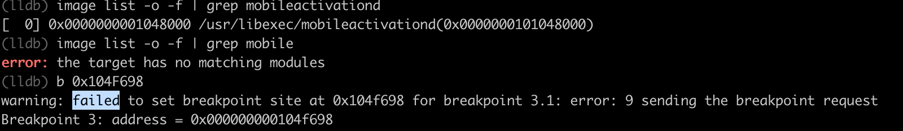

# lldb

此处主要整理，（debugserver+lldb的）`lldb`中断点加不上的情况：

## 地址有误

* 现象：warning failed to set breakpoint site at for breakpoint error 9 sending the breakpoint request

```bash
(lldb) b 0x104F698
warning: failed to set breakpoint site at 0x104f698 for breakpoint 3.1: error: 9 sending the breakpoint request
```



* 原因
  * 表面原因：地址写错了
  * 底层原因：`image list`中输出的库的ALSR基地址，搞错了

* 具体解释

此处，从lldb的image list中输出：

```bash
(lldb) image list -o -f | grep mobileactivationd
[  0] 0x0000000001048000 /usr/libexec/mobileactivationd(0x0000000101048000)
```

根据之前经验，以为，最前面的值：

* `0x0000000001048000`

就是：此处库的ALSR基地址

由此，后续手动算出来的函数地址是：`0x104F698`

但是实际上是：

最后括号中的地址：

* `0x0000000101048000`
  * 比前面的值，多出个`0x0000000100000000`

才是真正的库的ALSR基地址

* 解决办法

用真正的ALSR基地址：`0x0000000101048000`

* `/usr/libexec/mobileactivationd`
  * 基地址=image base：
    * **是**（最后括号中的地址）：`0x0000000101048000`
      * **不是**（之前看到的，最前面的地址）：`0x0000000001048000`

去计算：

* 之前IDA中的地址：`0x100007698`
* （IDA内）二进制内偏移量地址 = 去掉IDA中的基地址后是：
  * `0x100007698` - `0x100000000`
  * = `0x7698`
* 加上此处mobileactivationd的ALSR基地址
  * `0x0000000101048000` + `0x7698`
  * = `0x10104F698`

-》函数内部某代码地址：`0x10104F698`

-》即可正常加断点：

```bash
(lldb) b 0x10104F698
Breakpoint 4: where = mobileactivationd`getPcrt_1000075C0 + 216, address = 0x000000010104f698
```

## 所属动态库还没加载

* 现象

```bash
(lldb) b vsPHbdGf
Breakpoint 4: no locations (pending).
WARNING:  Unable to resolve breakpoint to any actual locations.
```


* 原因：函数所属动态库还没加载
  * 此处函数`vsPHbdGf`所属的动态库是`libInFieldCollection.dylib`，而此时该动态库还没加载到内存，还没运行
* 解决办法：想办法触发和加载对应动态库加载（到内存，开始运行），然后才能正常添加其中函数的断点
* 具体做法：此处iPhone中激活界面Setup，点击继续去激活，即可内部触发动态库`libInFieldCollection.dylib`去加载运行，即可继续添加函数断点
