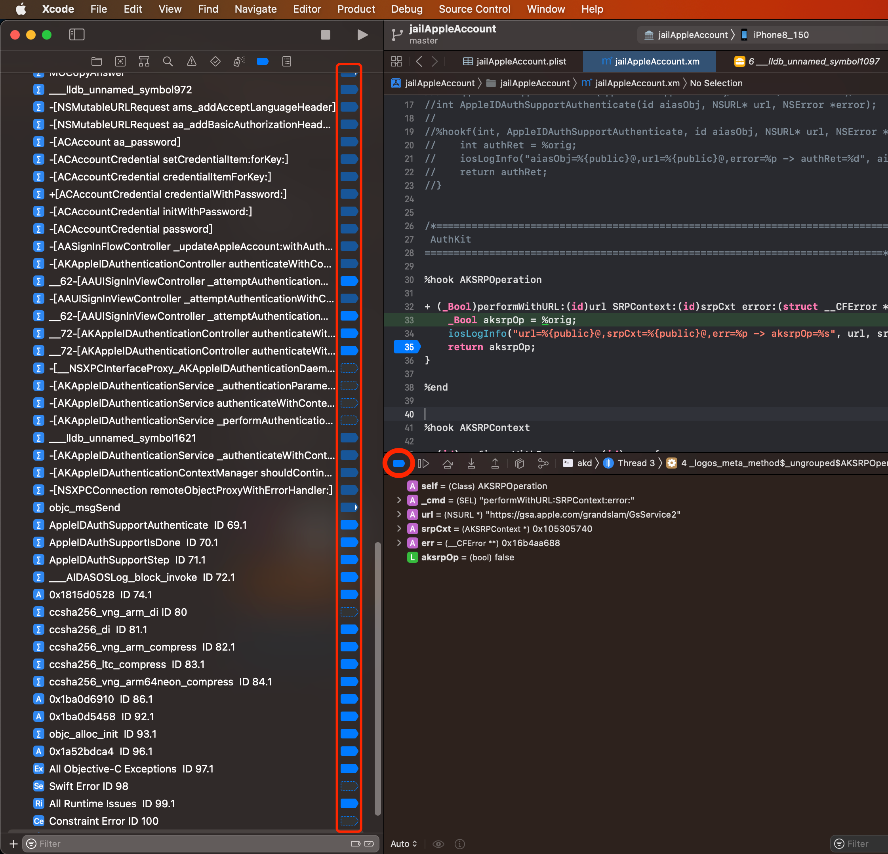
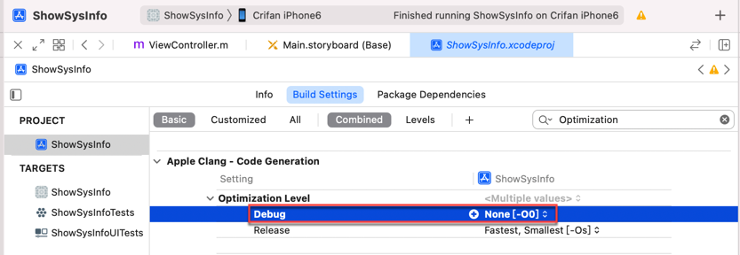

# Xcode

关于如何确保，Xcode中，断点能加上，且能触发，已整理至：

* [断点能加上且能触发](../../note_summary/xcode/added_and_trigger.md)

下面继续整理其他方面的：Xcode中断点加不上的一些情况：

## Xcode本身有bug

* 现象：Xcode中，加了断点，很快（没几秒），断点又掉了
* 原因：Xcode本身有bug
  * 解决办法：清除当前已编译内容
  * 具体步骤：`Xcode`->`Product`->`Clean Build Folder`
    * 注：如果需要，可以多试几次
    * 

## Xcode中不小心关闭了调试

* 现象：Xcode中，点击源码，去加断点，加不上
* 原因：之前（无辜，不小心）关闭了`调试`
  * 解决办法：（重新）开启调试
  * 具体步骤：`Xcode`->`Product`->`Scheme`->`Edit Scheme`->`Run`->`Info`
    * 把`Build Configuration`设置为`Debug`，且勾选`Debug executable`
      * 

## Xcode中关闭/禁用了所有断点

* 现象：Xcode中断点都掉了
* 原因：之前（不小心）关闭了（临时）所有的断点
  * 此时：如果切换到断点试图，也会看到，所有断点已（从之前的蓝色）变成灰色了 + 鼠标移动上去，会提示：`Active Breakpoints`
    * 
  * 解决办法：点击该（临时关闭或开启所有的断点）按钮，开启所有断点
    * 点击后，所有断点就恢复蓝色了
      * 

## Xcode的调试信息被优化掉了

* 现象：Xcode中，点击源码，去加断点，加不上
* 原因：Debug调试模式下，调试信息被优化掉了
  * 解决办法：恢复Debug调试模式下，不做任何优化
  * 具体步骤：`Xcode`->`PROJECT`->`<YourProjectName>`->`Build Settings`->`Apple Clang`->`Code Generation`->`Optimization Level`->`Debug`设置为`None[-O0]`
    * 注：`None[-O0]`表示`Optimize`=优化为`0`=不做任何额外的优化
      * 
