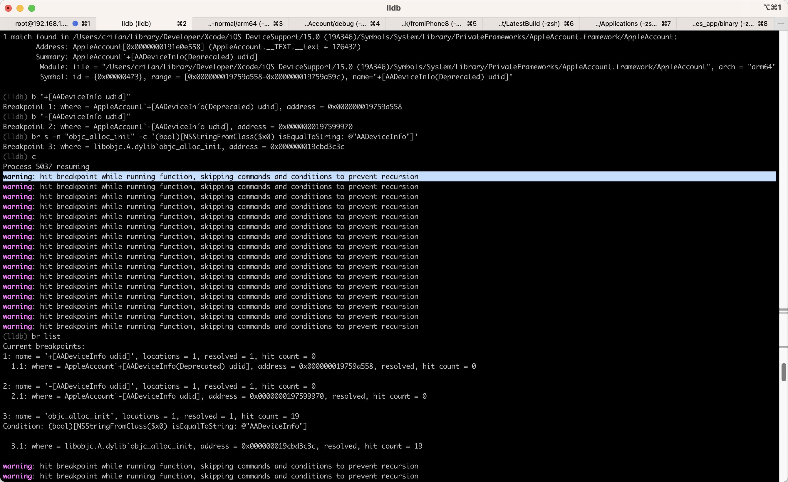

# lldb

## Xcode中可用的断点在lldb中却不可用

此处用`debugserver`去调试设置`Preferences`的app：

* `iPhone8`
  ```bash
  /usr/bin/debugserver 0.0.0.0:20235 -a 255
  ```
* `Mac`
  ```bash
  lldb
  process connect connect://192.168.2.13:20235
  ```
然后去：
* 给`objc_alloc_init`加上带条件判断的断点：
  ```bash
  br s -n "objc_alloc_init" -c '(bool)[NSStringFromClass($x0) isEqualToString: @"AADeviceInfo"]'
  br s -n "objc_alloc_init" -c '(int)strcmp((char *)class_getName($x0),"AADeviceInfo")==0'
  ```
  * 注：这2个带条件判断的断点
    ```bash
    (bool)[NSStringFromClass($x0) isEqualToString: @"AADeviceInfo"]
    (int)strcmp((char *)class_getName($x0),"AADeviceInfo")==0
    ```
    * 之前在Xcode图形界面中，都是可以正常工作的：能添加的上断点，且能触发断点

就会导致：

* 设置app出现：**白屏**，**卡死**
  * 有时候会：过了段时间（很多分钟后），设置app又恢复正常操作，但是始终会：
* 报错
  * `warning: hit breakpoint while running function, skipping commands and conditions to prevent recursion`
    * 

至此，无法正常用上述2个条件判断断点，通过debugserver+lldb调试。

所以最终放弃。

暂时不清楚：

* 为何之前Xcode中可以正常工作的2个断点，在lldb命令行中却无法工作
