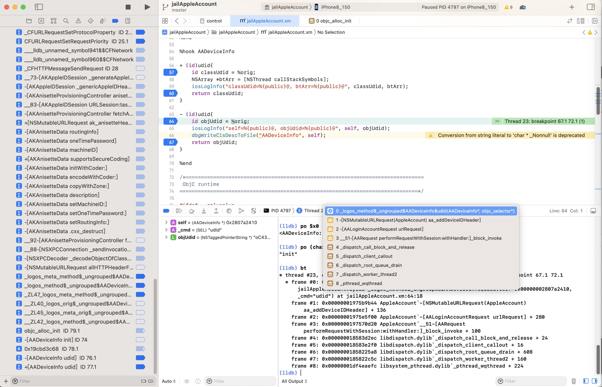
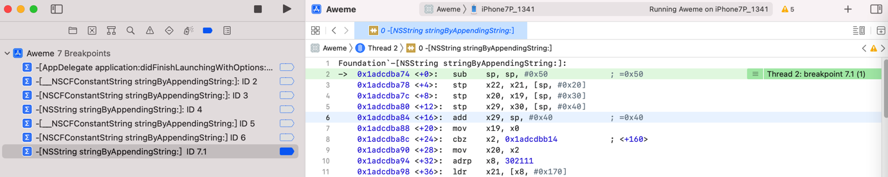

# 断点没触发

## 举例

### AppleAccount的函数：`+[AADeviceInfo udid]`和`-[AADeviceInfo udid]`

* 现象
  * （iOSOpenDev的）hook插件可以触发
  * 但是：debugserver+lldb调试时，断点可以加上，但是却无法触发（断点）
* 原因：调试目标不匹配
  * iOSOpenDev的插件的hook目标是：`com.apple.Preferences`=设置app
  * Xcode调试目标是：`akd`二进制
* 解决办法：确保目标一致
  * 插件代码的hook目标是：`com.apple.Preferences`=设置app=Preferences
  * Xcode去调试的目标是：`Preferences`进程（的`PID`）
    * 注：此处Preferences的PID=4797
      * 

### -[__NSCFConstantString stringByAppendingString:]

XCode调试抖音ipa崩溃，发现崩溃日志是：

```bash
Terminating app due to uncaught exception 'NSInvalidArgumentException', reason: '*** -[__NSCFConstantString stringByAppendingString:]: nil argument'
```

以为对应symbol函数是：

```bash
-[__NSCFConstantString stringByAppendingString:]:
```

去添加断点，结果：断点没触发

最后确认，问题的原因和解决办法分别是：

* 此处有2层错误
  * 第一层是：语法错误 -》 函数名有误
    * 末尾多了个冒号`:`
      ```bash
      -[__NSCFConstantString stringByAppendingString:]:
      ```
      * 因此：实际上函数断点也没加上，更不会触发断点
    * 应该改为：
      ```bash
      -[__NSCFConstantString stringByAppendingString:]
      ```
  * 第二层是：类名搞错了
    * 不是`__NSCFConstantString`，而是`NSString`
      * 此处函数（的类）搞错了，此处实际上应该用（`__NSCFConstantString`的所属的`CF`=`CoreFoundation`）对应的`NS`的类：`NSString`
    * 所以应该写成
      ```bash
      -[NSString stringByAppendingString:]
      ```

即可正常触发断点，效果是：



### objc_alloc_init

Xcode中加的条件判断的断点：

* 函数objc_alloc_init
  * `(bool)[$x0 isKindOfClass: (Class)objc_getClass("AADeviceInfo")]`
* 函数objc_alloc_init 内的汇编代码
  * `(bool)[$x0 isKindOfClass: (Class)objc_getClass("AADeviceInfo")]`

没有生效的原因：

（1）

* 函数objc_alloc_init
  * (bool)[$x0 isKindOfClass: (Class)objc_getClass("AADeviceInfo")]
    * 没生效的原因

objc_alloc_init传入参数是Class，此处isKindOfClass不适用于Class，只适用于Instance，所以无效。


（2）对于条件判断写法：

* `(bool)[$x0 isKindOfClass: objc_getClass("AADeviceInfo")]`

之前经过lldb命令测试发现objc_getClass返回的结果类型无法识别：

```bash
(lldb) po [$x0 isKindOfClass: objc_getClass("AADeviceInfo")]
error: expression failed to parse:
warning: <user expression 25>:1:2: receiver type 'unsigned long' is not 'id' or interface pointer, consider casting it to 'id'
[$x0 isKindOfClass: objc_getClass("AADeviceInfo")]
 ^~~
error: <user expression 25>:1:21: 'objc_getClass' has unknown return type; cast the call to its declared return type
[$x0 isKindOfClass: objc_getClass("AADeviceInfo")]
```

所以最后要改为：

```bash
(bool)[$x0 isKindOfClass: (Class)objc_getClass("AADeviceInfo")]
```

才至少确保语法上是正确的（至少po可以正常解析执行）

```bash
(lldb) po [$x0 isKindOfClass: (Class)objc_getClass("AADeviceInfo")]
nil
```

（3）之前的：

* 函数objc_alloc_init 内的
  * 汇编代码
    ```asm
    libobjc.A.dylib`objc_alloc_init:
    ...
      0x19cbd3c68 <+44>: b      0x19cbcd000              ; objc_msgSend
    ```
  * 的条件判断
    * `(bool)[$x0 isKindOfClass: (Class)objc_getClass("AADeviceInfo")]`
      * 没有生效

应该就是此处最终找到的原因：

实际上是代码本身没运行到，所以断点没触发

而断点的条件判断：

* `(bool)[$x0 isKindOfClass: (Class)objc_getClass("AADeviceInfo")]`

本身，对于

`0x19cbd3c68 <+44>: b      0x19cbcd000              ; objc_msgSend`

来说是正确的，没有问题的。

而实际上是代码本身没运行到，是由于：

* 之前的：插件hook的目标（`com.apple.Preferences`）和Xcode调试的目标（`akd`）不一致，导致的

此处已经解决了此处问题，确保：

* 现在的：插件hook的目标（`com.apple.Preferences`）和Xcode调试的目标（`com.apple.Preferences`的`PID`）是一致的

就确保代码能执行到，可以触发，条件判断语法是正确的断点了。

（4）对于最新的断点：

* `objc_alloc_init`
  * `(bool)[NSStringFromClass($x0) isEqualToString: @"AADeviceInfo"]`

后续经测试确认，也是可以正常触发断点的。
