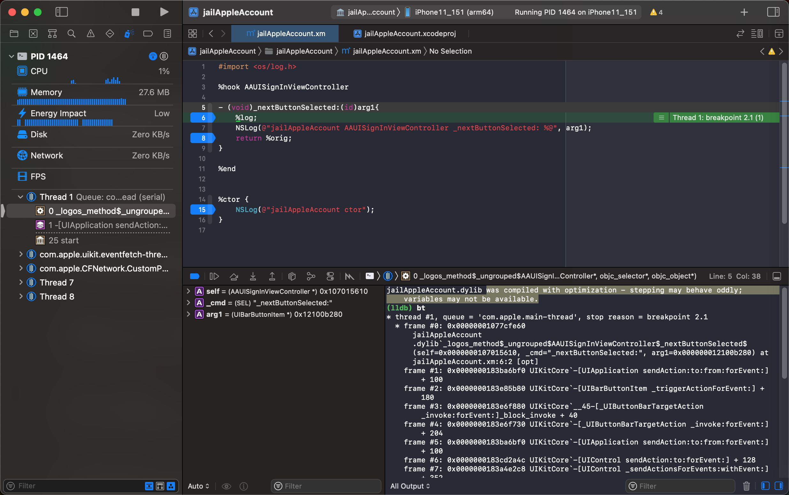
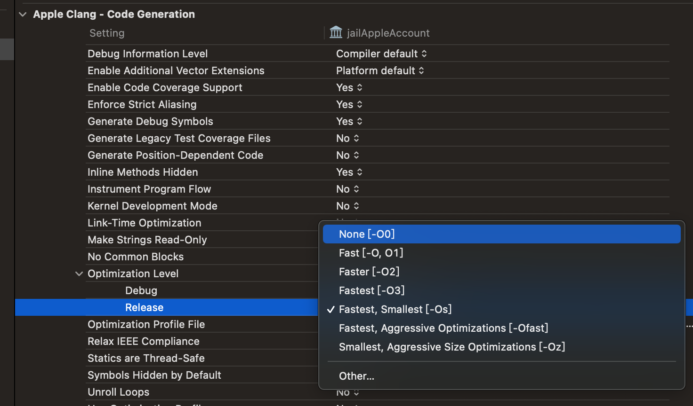

# Xcode

此处整理Xcode中断点相关的常见问题：

## was compiled with optimization - stepping may behave oddly; variables may not be available

* 问题

Xcode中编译的iOSOpenDev的dylib插件，去调试时，右下角调试窗口输出警告信息：

`jailAppleAccount.dylib was compiled with optimization - stepping may behave oddly; variables may not be available.`



* 原因

Xcode在编译代码时（默认就）启用了优化：

`Xcode`->`Targets`->`xxx`->`Build Settings`->`Apple Clang - Code Generation`->`Optimization Level`中的`Release`，默认是：`Fastest, Smallest [-Os]`

含义是：程序尽可能的快，文件尽可能的小。

涉及到的内部优化，就可能会把部分调试相关内容优化去掉，从而可能导致调试时出现上述的现象：

* stepping may behave oddly
  * 单步（进入或跳过）调试时，会出现奇怪的现象
    * 因为部分代码可能被优化掉了
      * 从而该代码单步执行可能执行不到，或者和源码对不上
* variables may not be available
  * 部分变量可能会被优化掉

* 解决办法：去掉优化，保留调试信息
* 具体步骤：
  * 把上述中，`Release`的`Optimization Level`的值改为`None [-O0]`
    * 图
      * 
      * 
    * 表示：不（做任何）优化
      * 从而保留了调试信息
        * 后续
          * 单步调试就正常了，和代码对得上了
          * 变量值也不会丢失了

## Xcode触发断点后长时间无操作好像调试会断开

* 现象

用Xcode去Attach到Preferences进程，然后能触发到之前hook代码的断点，可以正常调试了。

触发断点后，暂停了很多秒后，且期间没有任何操作后：

好像断点会丢失，具体现象是，app好像自动接着运行了，但此处断点还停在代码断点处

后来，又出现类似问题：

长时间没任何操作，app页面一闪，然后好像就和当前Xcode断开连接了，而无法继续正常调试了：

虽然Xcode中可以单步调试，但是实际上是已经断开了

-》 单步调试的结果：，都是不正常的：

比如连续多次调试后，此处进入了一个不知名的进程：


且也看不到调用堆栈了。

* 原因：暂时不能完全确定就是Xcode的问题或bug
* 尝试解决：
  * 期间去试过：
    * 加大连接超时的时间方面的设置：`plugin.process.gdb-remote.packet-timeout`=`1200`
      ```bash
      crifan@licrifandeMacBook-Pro  ~  cat ~/.lldbinit
      command script import /usr/local/opt/chisel/libexec/fbchisellldb.py
      command script import "~/Library/Application Support/Realm/rlm_lldb.py" --allow-reload
      settings set plugin.process.gdb-remote.packet-timeout 1200
      ```
  * 好像问题有所缓解
  * 后续暂时没怎么遇到这个问题，算是基本解决了
  * 注：但可能还会偶尔复发，暂时去不确定。
