# hook代码的断点

此处整理，Xcode中，对于（用iOSOpenDev等工具去写）hook代码时，加的断点方面的常见问题和相关经验心得。

## 给当前行加断点却看不到

Xcode中的汇编代码加断点后，默认改行左边会显示蓝色底色，表示加了断点了：

比如：

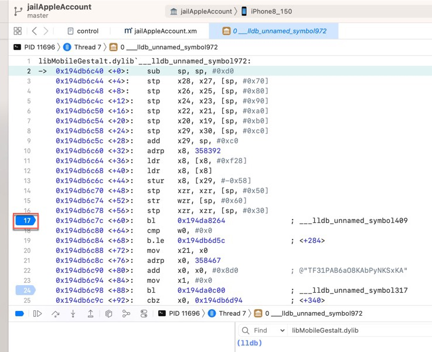

但是，当给，调试时函数调用堆栈中，上层某层函数的汇编代码的下一行将要执行的汇编代码，去加断点时，结果：

点击了左边的空白处，但是：没有出现（表示断点添加成功的）蓝色底色：

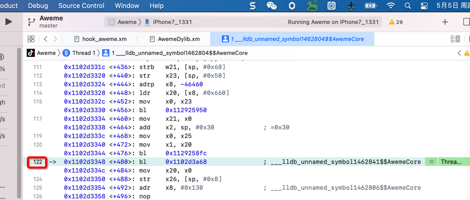

以为是：没有成功（给该行汇编代码）加上断点

其实就是没有成功添加断点，且

* 是无法给该行（断点时，上层某函数的，将要执行的下一行汇编代码）加上断点的
  * 因此：此时右键该行左边空白处，是看不到=无法出现右键菜单的
    * 对比：其他普通已经加上断点的地方出现的，右键是可以出现，编辑断点、删除断点等功能的右键菜单的

## xm源码中无法看到和添加断点

* 问题

在Xcode从`13.1`升级到`13.2.1`后，之前已用`Logos`写了很多hook代码，比如`youtubeDylib.xm`，且其中给hook代码加了很多断点，但是此处发现：

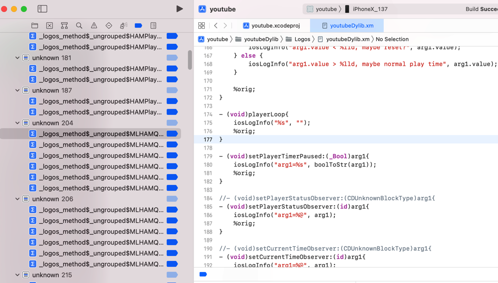

断点都看不到了，所以点击右键也没反应

* 原因：Xcode的版本升级，把之前安装的`Logos`语法高亮的插件覆盖没了，导致语法高亮失效，断点也看不到

* 解决办法：让Xcode识别xm文件，即可显示和操作断点
* 具体步骤

Xcode中安装Logos语法高亮的插件：

https://github.com/brendonjkding/Logos-Xcode11.git

效果：正常情况下，切换到Logos后，语法高亮就正常了：

xm文件中的`%orig`、`%hook`等正常的高亮显示了，且断点也正常显示和操作

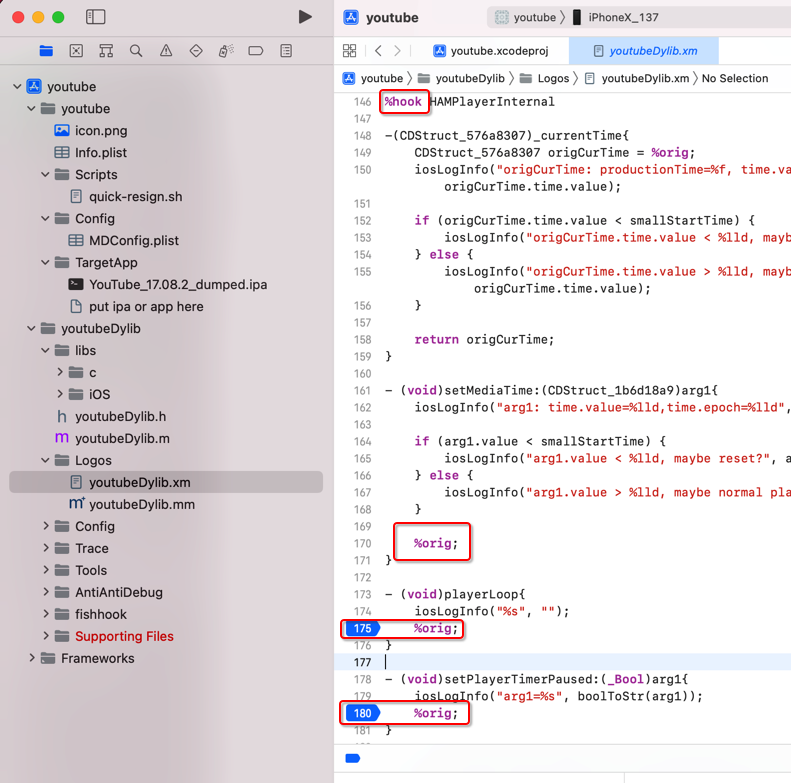

注：如果偶尔会遇到其他的：Logos语法高亮有问题，或者是xm断点不显示了，则关闭文件后重新打开，多试试几次，估计就可以了。至少暂时是这样。

## 给函数加hook代码的同时加函数名断点会导致EXC_BREAKPOINT的崩溃

iOS逆向期间，之前遇到一些次数的特殊情况：

对于某个函数，如果去加上了hook代码之后，额外再加上该函数的函数名的断点，则往往就会导致崩溃：

### dladdr

之前给dladdr加了hook：

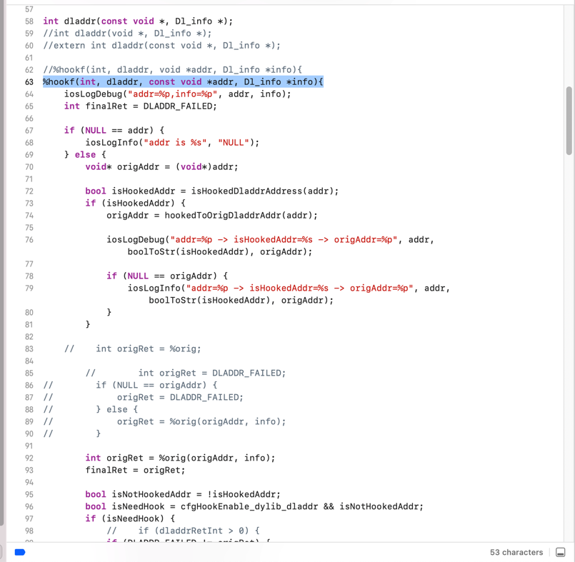

然后也给了`dladdr`函数名加了断点：

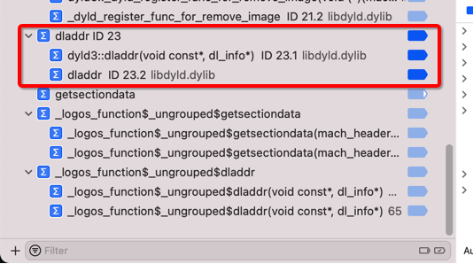

结果调试期间，`getsectiondata`中调用`dladdr`的地方，就崩溃了：

```bash
Thread 1: EXC_BREAKPOINT (code=1, subcode=0xe7ffdefe)
```

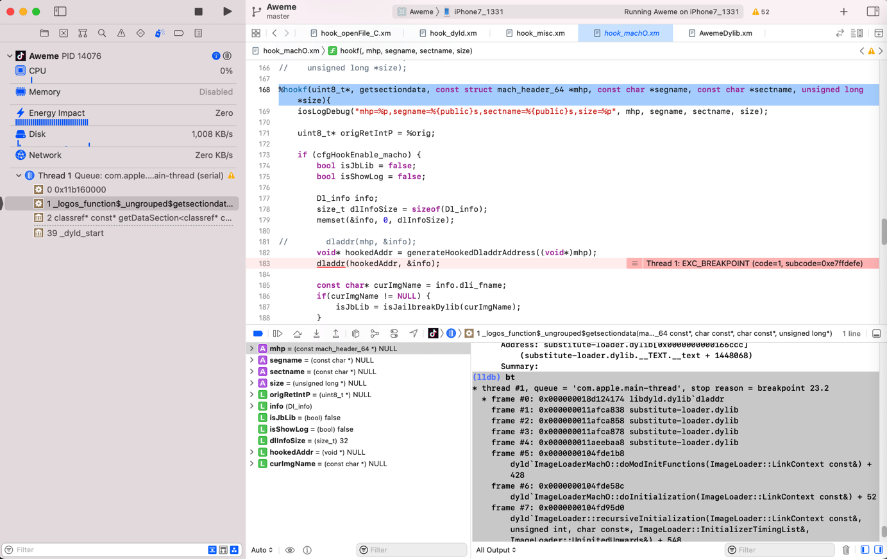

后来去，禁用了`dladdr`的断点：

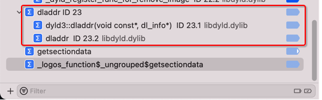

就不会出现之前的崩溃了。

### _dyld_register_func_for_add_image

之前已给`_dyld_register_func_for_add_image`加了hook代码：

```c
%hookf(void, _dyld_register_func_for_add_image, void (*func)(const struct mach_header* mh, intptr_t vmaddr_slide)){
//    iosLogInfo("%sfunc=%p -> Omitted", HOOK_PREFIX(cfgHookEnable_dyld), func);
   iosLogInfo("%sfunc=%p", HOOK_PREFIX(cfgHookEnable_dyld), func);

//#ifndef XCODE_DEBUG
   %orig;
//    %orig(func);
//#endif
}
```

且也同时给函数名：

```bash
_dyld_register_func_for_add_image
```

加了断点：

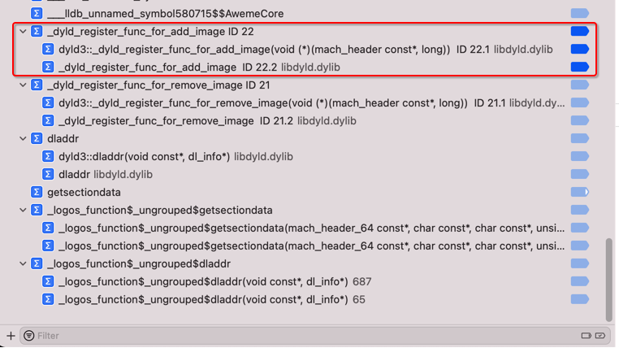

然后调试后，就会出现：

```c
%hookf(void, _dyld_register_func_for_add_image, void (*func)(const struct mach_header* mh, intptr_t vmaddr_slide)){
...
   %orig;
...
```

其中的`%orig`去运行，就会崩溃：

```bash
Thread 1: EXC_BREAKPOINT (code=1, subcode=0xe7ffdefe)
```

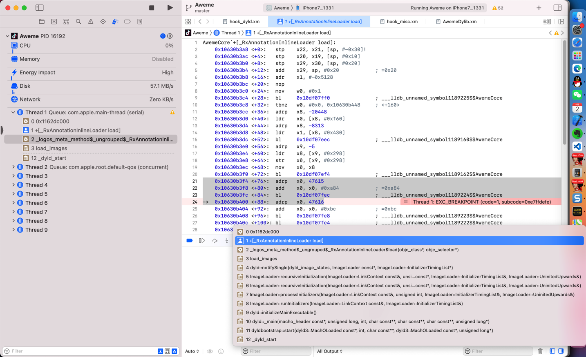

而去掉（此处是禁用）断点后：

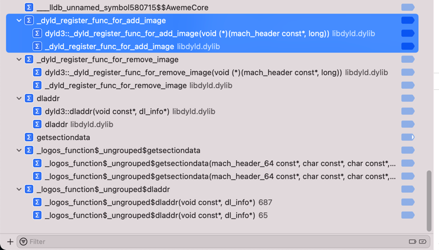

崩溃问题就消失了。

## 触发到xm源码中函数断点但是显示音频文件图标

* 问题

此处遇到一个奇怪问题：

`Xcode`中`iOSOpenDev`的`logos`插件代码`.xm`文件中，给（`NSXPCConnection`的`resume`）函数写了hook代码，且加上了断点，去调试，结果：

虽然是触发了断点，但是却显示出了音频文件图标，而不是`.xm`源码的断点的地方

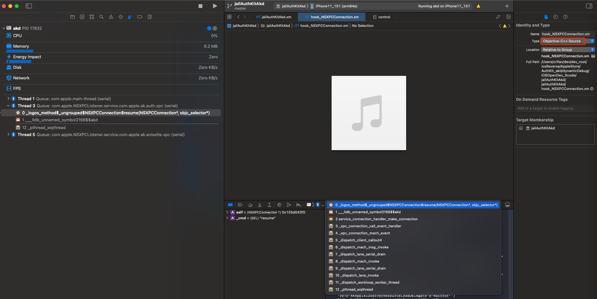

* 另：此处已经确认文件类型设置无误
  * 已点击Xcode右上角的文件类型`Type`，已经设置`xm`是`Objective-C++ Source`
    * 而不是默认的音频文件类型了。

但是不知道此处为何调试触发断点时，显示的是音频文件图标。

* 原因：经过调试研究确认，基本上确认是，Xcode的偶发性的bug而已。
* 解决办法：重启Xcode
  * 即可正常触发断点，Xcode界面跳转到Logos的hook代码处
    * 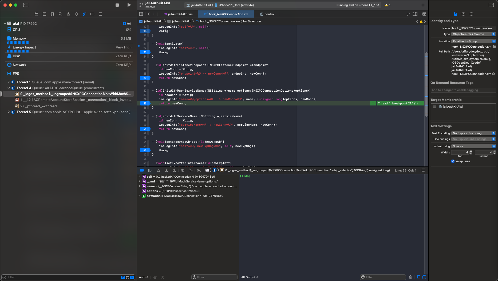
