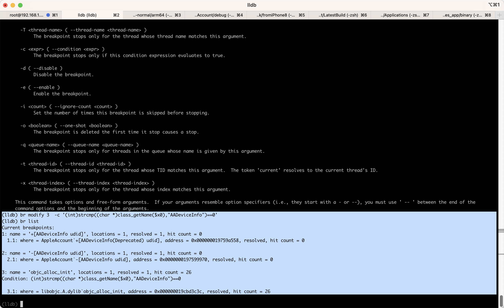

# 条件判断

* `带条件判断的断点`=`conditional breakpoint` = 给普通的断点，加上条件判断
  * 条件判断添加方式
    * Xcode图形界面：断点的`Condition`中加上`判断语句`=`表达式`=`expression`=`expr`
      * 
    * lldb命令行：加断点时，加上`-c <expr>` == `--condition <expr>`
      * 语法
        ```bash
        breakpoint set --name <function_name> -c <expr>
        ```
        * 说明
          * `-c <expr>`
            * 特殊：如果`<expr>`中包含双引号`"`，则最外层用单引号`'`
              * 举例
                ```bash
                br s -n "objc_alloc_init" -c '(bool)[NSStringFromClass($x0) isEqualToString: @"AADeviceInfo"]'
                ```
          * 参数引用
            * `$x0`：引用寄存器`x0`的值
  * 引用值 = 条件判断的断点中引用对应的值的写法
    * 寄存器：`$x0`、`$x1`、`$x2`等等
      * 适用于：任何地方，包括普通函数和某个地址(某行汇编代码)
    * 参数：第一个参数：`$arg1`、第二个参数：`$arg2`、第三个参数：`$arg3`，等等
      * 适用于：普通函数（才有参数）

## 更改判断条件

如果之前已给断点加了条件判断，而想要去更改条件：

* Xcode图形界面：右键某断点-》`Edit Breakpoint`-》直接修改`Condition`的值即可
* lldb命令行
  * 核心思路：用`br modify -c <new_expr>`

### lldb中更改条件判断

举例说明：

lldb命令行中，之前加了带条件判断的断点：

```bash
br s -n "objc_alloc_init" -c '(bool)[NSStringFromClass($x0) isEqualToString: @"AADeviceInfo"]'
```

加了后，对应的断点编号是：`3`

```bash
(lldb) br list
...
3: name = 'objc_alloc_init', locations = 1, resolved = 1, hit count = 19
Condition: (bool)[NSStringFromClass($x0) isEqualToString: @"AADeviceInfo"]

  3.1: where = libobjc.A.dylib`objc_alloc_init, address = 0x000000019cbd3c3c, resolved, hit count = 19
```

此处：想要修改该断点的condition条件判断

具体写法是：用modify

```bash
br modify 3  -c '(int)strcmp((char *)class_getName($x0),"AADeviceInfo")==0'
```

修改后，再去查看，即可看到：

```bash
(lldb) br list
...
3: name = 'objc_alloc_init', locations = 1, resolved = 1, hit count = 26
Condition: (int)strcmp((char *)class_getName($x0),"AADeviceInfo")==0

  3.1: where = libobjc.A.dylib`objc_alloc_init, address = 0x000000019cbd3c3c, resolved, hit count = 26
```

* condition已经变成新设置的条件了：
  * `Condition: (int)strcmp((char *)class_getName($x0),"AADeviceInfo")==0`


