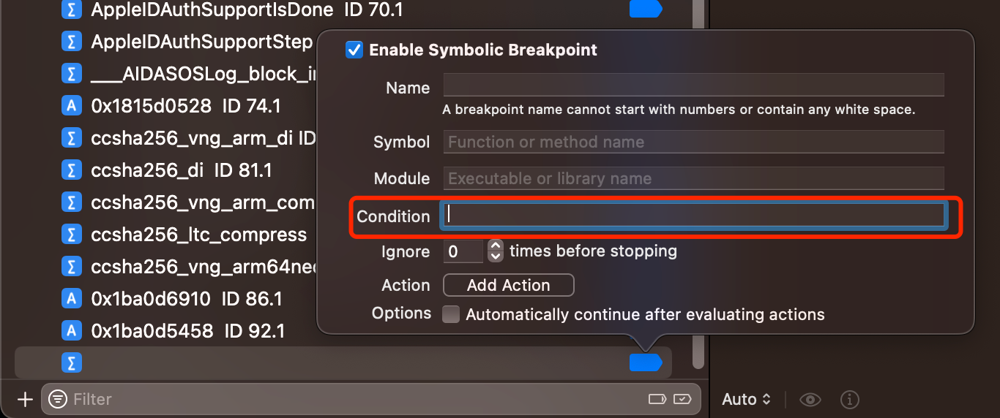

# 条件判断

* `带条件判断的断点`=`conditional breakpoint` = 给普通的断点，加上条件判断
  * 条件判断添加方式
    * Xcode图形界面：断点的`Condition`中加上`判断语句`=`表达式`=`expression`=`expr`
      * 
    * lldb命令行：加断点时，加上`-c <expr>` == `--condition <expr>`
      * 语法
        ```bash
        breakpoint set --name <function_name> -c <expr>
        ```
        * 说明
          * `-c <expr>`
            * 特殊：如果`<expr>`中包含双引号`"`，则最外层用单引号`'`
              * 举例
                ```bash
                br s -n "objc_alloc_init" -c '(bool)[NSStringFromClass($x0) isEqualToString: @"AADeviceInfo"]'
                ```
          * 参数引用
            * `$x0`：引用寄存器`x0`的值
  * 引用值 = 条件判断的断点中引用对应的值的写法
    * 寄存器：`$x0`、`$x1`、`$x2`等等
      * 适用于：任何地方，包括普通函数和某个地址(某行汇编代码)
    * 参数：第一个参数：`$arg1`、第二个参数：`$arg2`、第三个参数：`$arg3`，等等
      * 适用于：普通函数（才有参数）
