# 条件判断的断点举例

## 函数

### 判断`MGCopyAnswer`的传入参数是否是字符串`UniqueDeviceID`

* 判断`MGCopyAnswer`的传入参数是否是字符串`UniqueDeviceID`
  * 条件判断表达式：
    ```bash
    (bool)[$x0 isEqualToString: @"UniqueDeviceID"]
    ```
    * 效果
      * 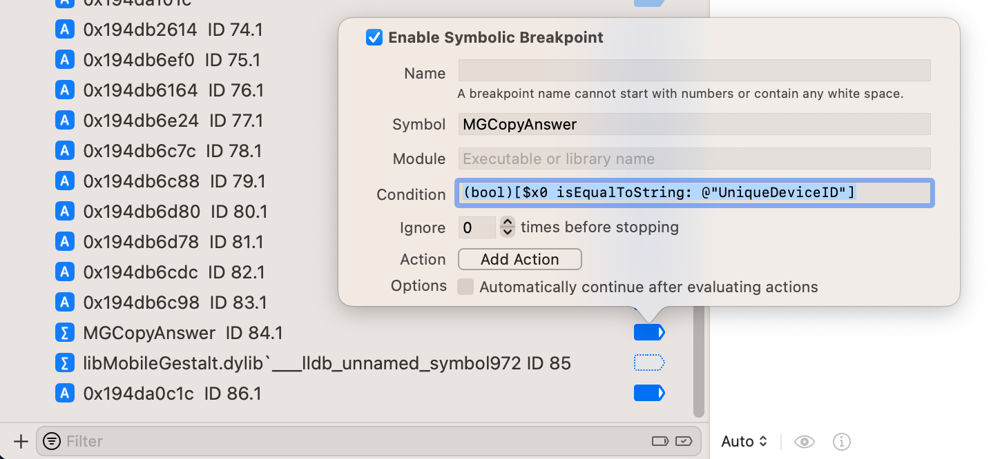

### 判断`_dyld_get_image_name`的第一个参数是`0` 或 `1`

* 判断`_dyld_get_image_name`的第一个参数是`0` 或 `1`
  * 条件判断表达式：`($arg1 == 0) || ($arg1 == 1)`
    * 
  * 断点生效的效果
    * 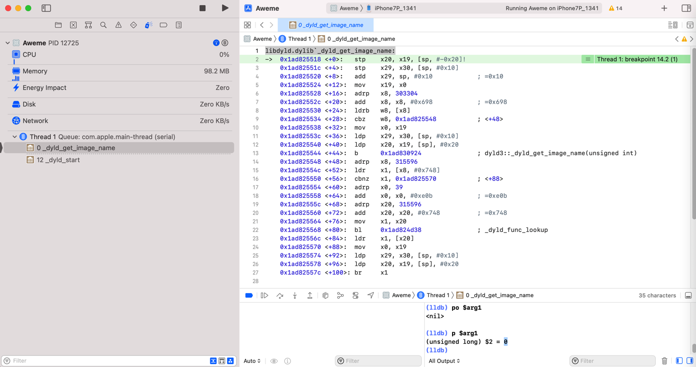

### 判断`-[NSString stringByAppendingString:]`传入参数是否为空

* 判断`-[NSString stringByAppendingString:]`传入参数是否为空
  * 注：此处是`objc_msgSend`，所以第一个参数是`id`=`self`，第二个参数是`selector`，第三个参数才是**真正的传入的值**
  * 条件判断表达式：`(BOOL)($arg3 == NULL)`
    * 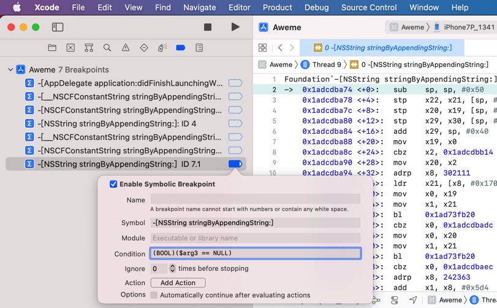

### 判断`objc_alloc_init`输入参数是类AADeviceInfo的`Class`

* 判断`objc_alloc_init`输入参数是类AADeviceInfo的`Class`
  * 条件过滤表达式写法
    * 三种写法
      * `NSStringFromClass`
        ```bash
        (bool)[NSStringFromClass($x0) isEqualToString: @"AADeviceInfo"]
        ```
      * `class_getName`
        ```bash
        (int)strcmp((char *)class_getName($x0),"AADeviceInfo")==0
        ```
      * `object_getClassName`
        ```bash
        (int)strcmp((char *)object_getClassName($x0),"AADeviceInfo")==0
        ```
  * => lldb命令行中
    * `NSStringFromClass`
    ```bash
    br s -n "objc_alloc_init" -c '(bool)[NSStringFromClass($x0) isEqualToString: @"AADeviceInfo"]'
    ```
    * `class_getName`
    ```bash
    br s -n "objc_alloc_init" -c '(int)strcmp((char *)class_getName($x0),"AADeviceInfo")==0'
    ```
    * `object_getClassName`
    ```bash
    br s -n "objc_alloc_init" -c '(int)strcmp((char *)object_getClassName($x0),"AADeviceInfo")==0'
    ```
  * => Xcode图形界面中
    * `class_getName`
      * `Condition`: `(int)strcmp((char *)class_getName($x0),"AADeviceInfo")==0`
        * 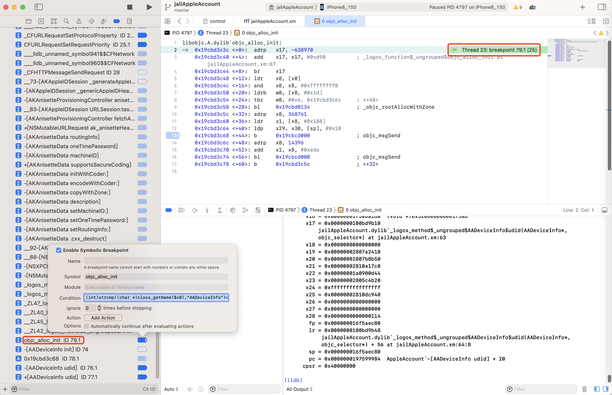
    * `NSStringFromClass`
      * `Condition`: `(bool)[NSStringFromClass($x0) isEqualToString: @"AADeviceInfo"]`
        * 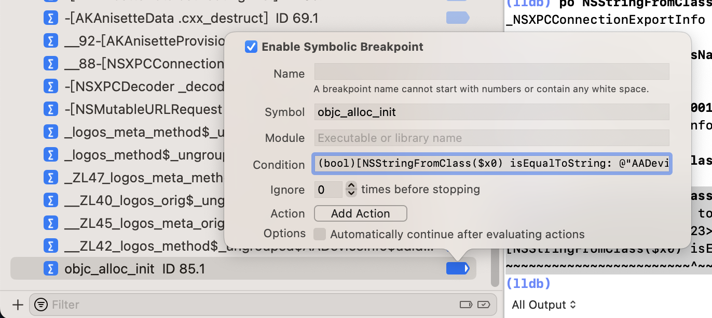
    * `object_getClassName`
      * `Condition`: `(int)strcmp((char *)object_getClassName($x0),"AADeviceInfo")==0`
        * 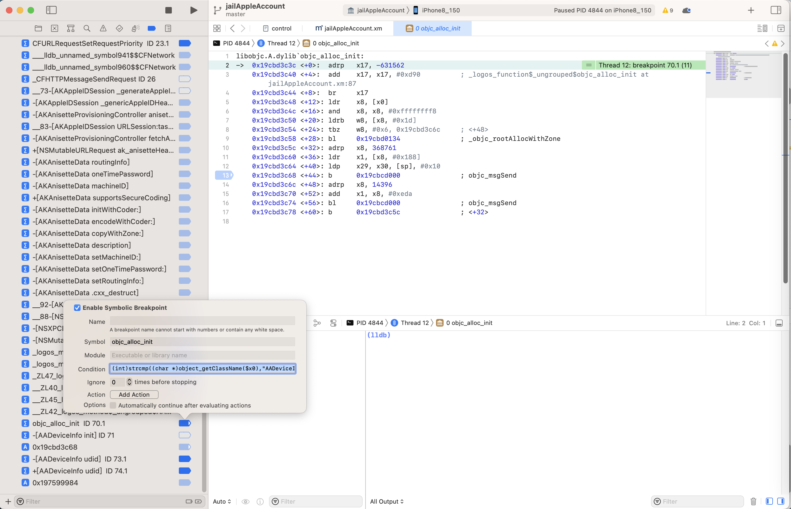

## 某行汇编代码

### `libMobileGestalt.dylib`的`___lldb_unnamed_symbol317`中的`+28`行汇编代码

给`libMobileGestalt.dylib`的`___lldb_unnamed_symbol317`中的`+28`行汇编代码

```bash
0x194da0c1c <+28>:   mov    x19, x0
```

加条件判断断点：

```bash
(bool)[$x0 isEqualToString: @"UniqueDeviceID"]
```

断点触发效果：

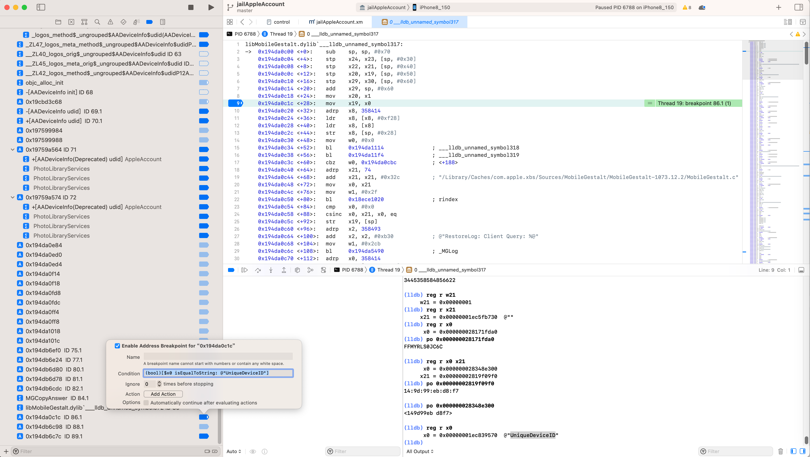

### `objc_alloc_init`的`+44`行的`objc_msgSend`行的汇编代码

* `objc_alloc_init`的`+44`行的`objc_msgSend`行的汇编代码
  * 判断输入参数是类`AADeviceInfo`的`Instance`实例
    * 条件判断表达式
      * `objc_getClass`
        * `Condiction`: `(bool)[$x0 isKindOfClass: (Class)objc_getClass("AADeviceInfo")]`
          * 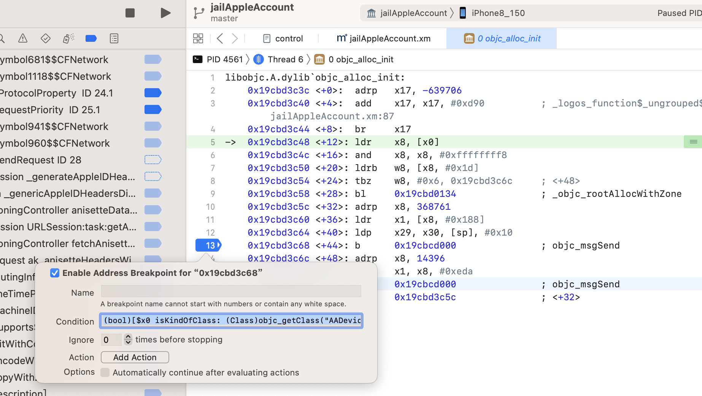
      * `className`
        * `Condiction`: `(bool)[[$x0 className] isEqualToString: @"AADeviceInfo"]`
          * 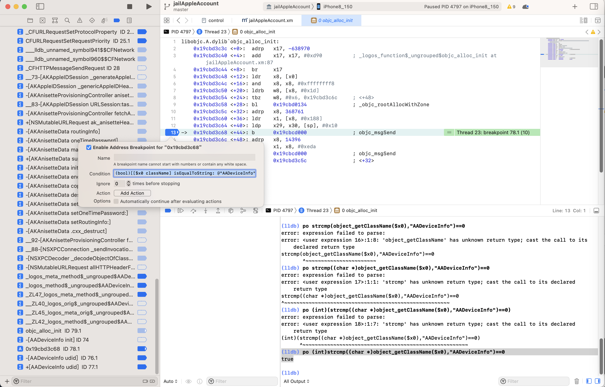
      * `object_getClassName`
        * `Condiction`: `(int)strcmp((char *)object_getClassName($x0),"AADeviceInfo")==0`
          * 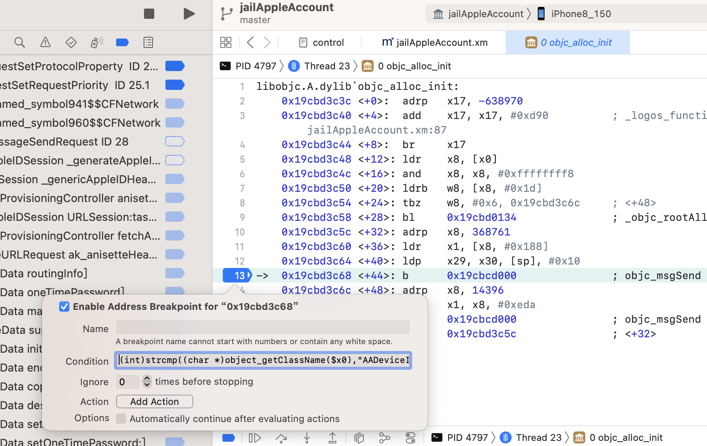
        * 触发效果
          * 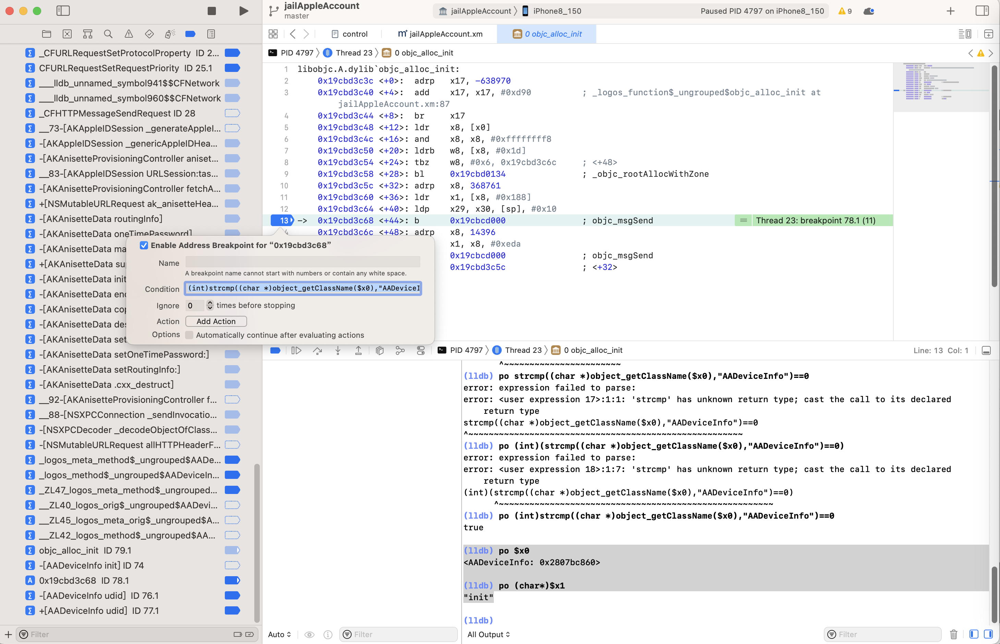

### `__88-[NSXPCConnection _sendInvocation:orArguments:count:methodSignature:selector:withProxy:]_block_invoke_3`中的`+208`行汇编代码

* 汇编代码
  ```asm
  Foundation`__88-[NSXPCConnection _sendInvocation:orArguments:count:methodSignature:selector:withProxy:]_block_invoke_3:
  ...
      0x1830c6a6c <+188>:  ldr    x3, [x19, #0x38]
      0x1830c6a70 <+192>:  ldp    x0, x4, [x19, #0x20]
      0x1830c6a74 <+196>:  adrp   x8, 297427
      0x1830c6a78 <+200>:  add    x1, x8, #0x5c6            ; =0x5c6 
      0x1830c6a7c <+204>:  mov    x2, x21
  ->  0x1830c6a80 <+208>:  bl     0x1815b9dc8              ; symbol stub for: objc_msgSend
  ```
* 通过调试看到值
  ```bash
  (lldb) reg r x0
        x0 = 0x0000000283265c20
  (lldb) po 0x0000000283265c20
  <NSXPCConnection: 0x283265c20> connection to service with pid 125 named com.apple.ak.anisette.xpc
  ```
* 想要加上条件判断实现：
  * x0中的NSXPCConnection的属性serviceName值是：com.apple.ak.anisette.xpc
* 研究条件判断写法的过程
  * lldb中的po调试
    * `po ((NSXPCConnection*)$x0).serviceName`
  * iOS的ObjC的写法
    * `[(NSXPCConnection*)$x0 serviceName]`
  * 类似C语言的写法
    * `(NSXPCConnection*)$x0).serviceName`
* 条件判断的表达式写法
  ```bash
  [[(NSXPCConnection*)$x0 serviceName] isEqualToString: @"com.apple.ak.anisette.xpc"]
  ```
  * 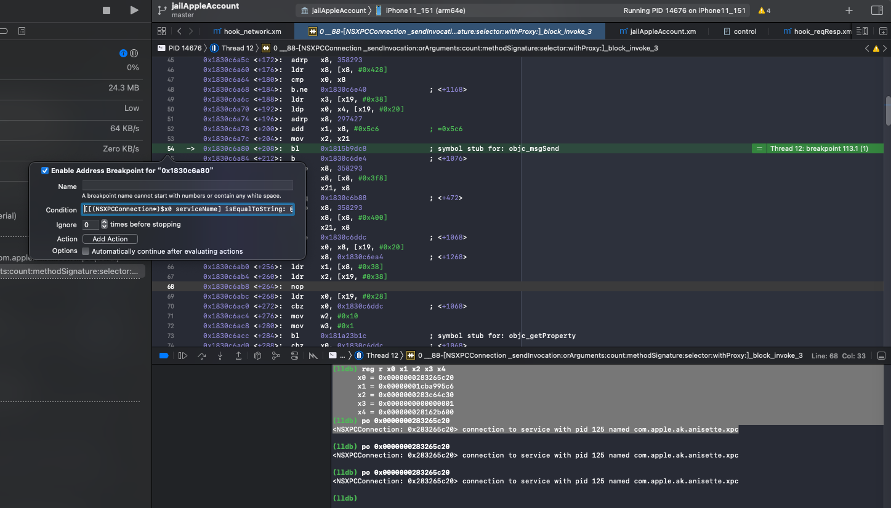
* 断点生效效果
  * 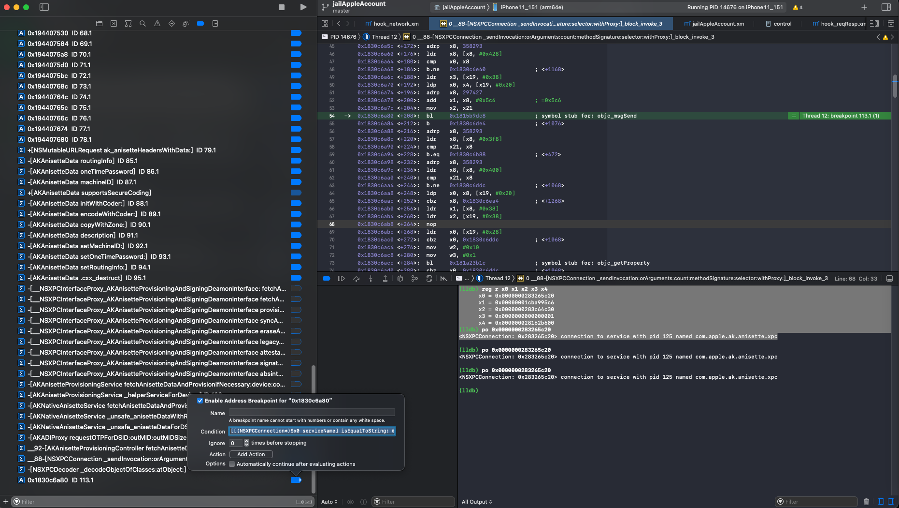
* 但是
  * 另外2种C语言的写法：
    * `strcmp`写法
      ```bash
      (bool)((int)strcmp(((NSXPCConnection*)$x0).serviceName,"com.apple.ak.anisette.xpc")==0)
      ```
    * `strstr`写法
      ```bash
      strstr((const char*)(((NSXPCConnection*)$x0).serviceName),"com.apple.ak.anisette.xpc")!=NULL
      ```
    * -》最终无效 -》无法触发条件断点


