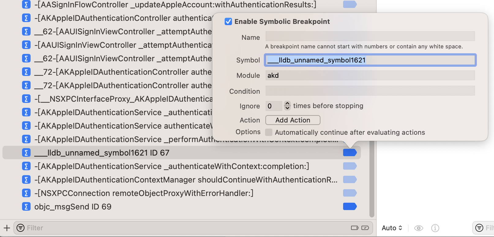
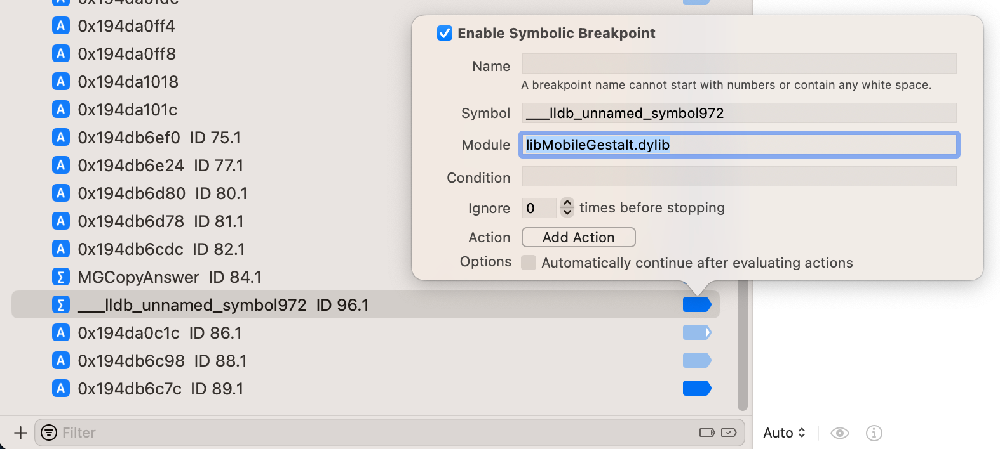
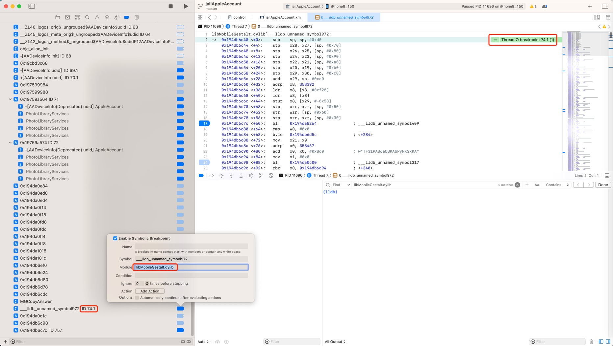

# 指定模块

* 概述
  * 加断点时，可以指定要去查找的`库`=`Module`=`模块`=`二进制`=`库文件`
    * Xcode图形界面：设置断点的**Module**=某个`模块名`=`二进制文件名`=`库文件名`
    * lldb命令行：加断点的参数时加上`-s libName` == `--shlib libName`

* 详解

## 举例

### akd中的___lldb_unnamed_symbol1621

* akd中的___lldb_unnamed_symbol1621
  * 参数
    * `Symbol`：`___lldb_unnamed_symbol1621`
    * `Module`：`akd`
  * Xcode中
    * 

### libMobileGestalt.dylib`___lldb_unnamed_symbol972

给函数：

* ``libMobileGestalt.dylib`___lldb_unnamed_symbol972``
  * 即：`libMobileGestalt.dylib` 中的（lldb无名函数）`___lldb_unnamed_symbol972`

加断点：

* Xcode图形界面
  * Xcode-》`Breakpoint Navigator` -》点击➕`加号`-》`Symbolic Breakpoint`-》
    * `Name`: `___lldb_unnamed_symbol972`
    * `Module`: `libMobileGestalt.dylib`
    * 如图
      * 
    * 注意
      * 不是直接添加``libMobileGestalt.dylib`___lldb_unnamed_symbol972``
      * 也不能 == 如果手动转换为`___lldb_unnamed_symbol972$$libMobileGestalt`，也是无效的
* lldb命令行
  ```bash
  br s -n "___lldb_unnamed_symbol972" -s libMobileGestalt.dylib
  ```
    * 其中
      * `br` = `breakpint`
      * `s` = `set`
      * `-n` = `--name`
      * `-s` = `--shlib`
    * 输出
      ```bash
      (lldb) br s -n "___lldb_unnamed_symbol972" --shlib libMobileGestalt.dylib
      Breakpoint 95: where = libMobileGestalt.dylib`___lldb_unnamed_symbol972, address = 0x0000000194db6c40
      ```

正常触发断点的效果：

* Xcode图形界面
  * 
