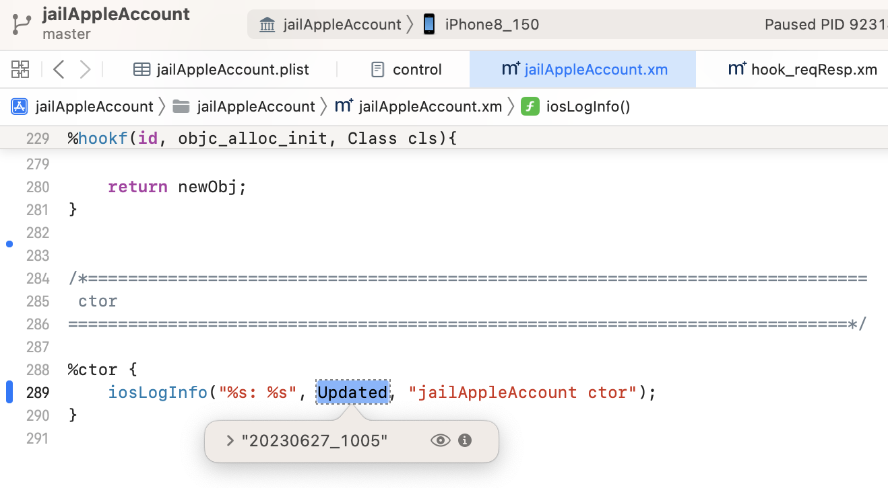

# 背景知识

## 查看进程PID

* 查看进程PID
  * 方式1
    * `Mac`中
      ```bash
      frida-ps -Uia
      ```
  * 方式2
    * `iPhone`的`ssh`中
      ```bash
      ps -A | grep Preferences
      ```

## 确保最新的dylib插件动态库被加载

* 小技巧：想要确保：最新的dylib插件动态库被加载了 -》 即可实现hook代码断点可以加上，且能触发断点
  * 可以通过`Console.app`=`控制台`中是否输出相关ctor日志确认dylib是否已加载，是否是新版本
    * 把ctor中代码加上最新版字符串
      ```c
      static char* Updated = "20230627_1005";
      ...
      %ctor {
        iosLogInfo("%s: %s", Updated, "jailAppleAccount ctor");
      }
      ```
      * 
    * 此处能输出最新版字符串，即表示dylib加载了，且是最新版
      ```bash
      默认  10:07:18.451903+0800  Preferences  hook_ jailAppleAccount.xm _logosLocalCtor_96660fcf: 20230627_1005: jailAppleAccount ctor
      ```
      * 

## 得到函数的实际地址

iOS逆向调试期间，往往需要搞清楚某个函数的实际地址，然后用于后续通过地址添加断点

而函数的实际地址，有多种方式可以获取到：

### 通过po查看类的描述，得到函数实际地址

举例说明：

当某个函数

`-[__NSXPCInterfaceProxy_AKAppleIDAuthenticationDaemonProtocol authenticateWithContext:completion:]`

去通过Xcode的UI界面去（调试期间，实时去）添加断点后，发现加不上断点 == 具体表现是 断点的底色不是蓝色，而是灰色，且是虚线边框

而想要去加断点的话，也通过函数模糊搜索：

```bash
im lookup -r -n "authenticateWithContext:completion:"
```

的确搜不到该函数

此时，想要给该函数加断点的话：

可以通过函数地址加断点，函数地址可以从po查看实例的描述中找到

```bash
(lldb) po [0x28211abc0 _shortMethodDescription]
<__NSXPCInterfaceProxy_AKAppleIDAuthenticationDaemonProtocol: 0x28211abc0>:
in __NSXPCInterfaceProxy_AKAppleIDAuthenticationDaemonProtocol:
     Instance Methods:
...
        - (void) authenticateWithContext:(id)arg1 completion:(id)arg2; (0xb74ee6818326cc9c)
(_NSXPCDistantObject ...)
```

* 该函数的实际地址：`0xb74ee6818326cc9c`

由此后续去通过该函数的实际地址添加断点：

```bash
breakpoint set -a 0xb74ee6818326cc9c
```

即可顺利加上断点，并真正触发到该断点。

### 计算出函数的实际地址

* 背景：已知函数在二进制内部的偏移量
* 希望：计算出函数的实际的地址
  * 计算公式：`函数实际地址`=`二进制的ALSR基地址`+`函数二进制内偏移量` 

### 举例

`RzGame`中的`sub_1000B0770`函数，起始地址是：`0x00000100157BB0`

而二进制`RzGame`的ALSR基地址，通过：

```bash
(lldb) image list -o -f | grep RzGame
[  0] 0x0000000000c04000 /Users/crifan/Library/Developer/Xcode/DerivedData/udg-cuzlxqfnklemxfexjbcfnupseasc/Build/Products/Debug-iphoneos/udg.app/RzGame
```

查看到是：`0x0000000000c04000`

所以：

* `sub_1000B0770`函数实际地址 = `二进制的ALSR基地址` + `函数二进制内偏移量` = `0x0000000000c04000` + `0x00000100157BB0` = `0x0000000100d5bbb0`
