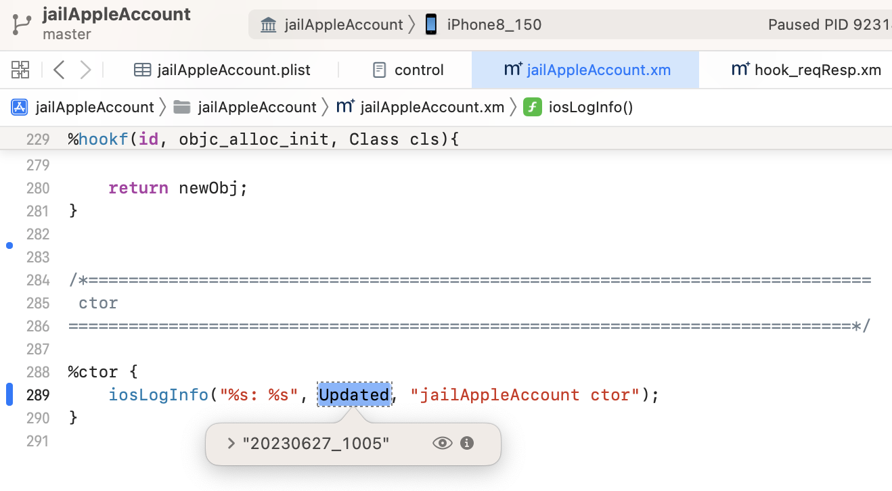
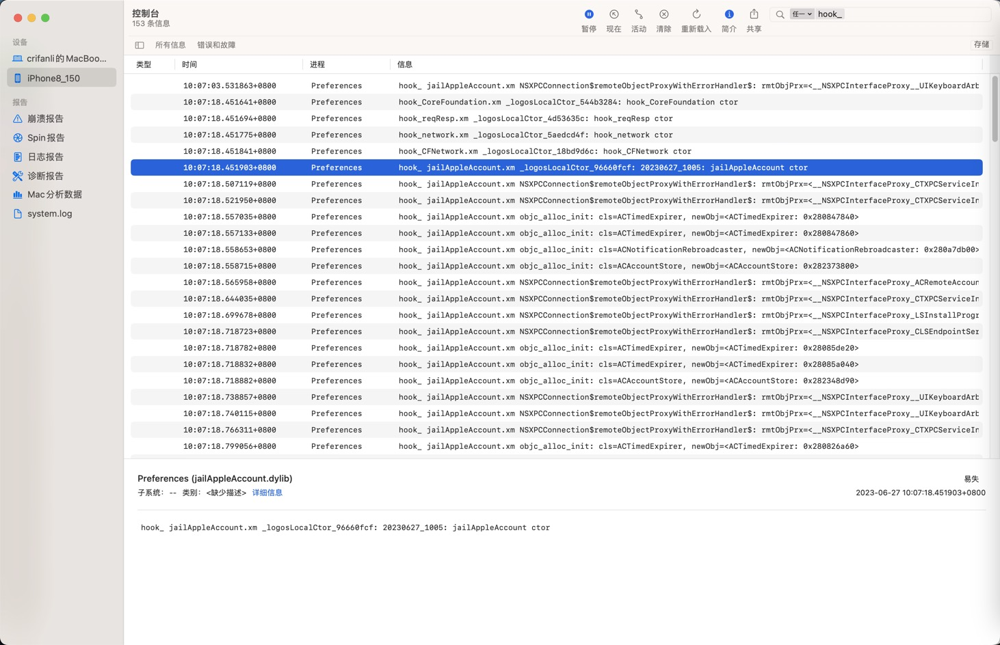

# 背景知识

## 查看进程PID

* 查看进程PID
  * 方式1
    * `Mac`中
      ```bash
      frida-ps -Uia
      ```
  * 方式2
    * `iPhone`的`ssh`中
      ```bash
      ps -A | grep Preferences
      ```

## 确保最新的dylib插件动态库被加载

* 小技巧：想要确保：最新的dylib插件动态库被加载了 -》 即可实现hook代码断点可以加上，且能触发断点
  * 可以通过`Console.app`=`控制台`中是否输出相关ctor日志确认dylib是否已加载，是否是新版本
    * 把ctor中代码加上最新版字符串
      ```c
      static char* Updated = "20230627_1005";
      ...
      %ctor {
        iosLogInfo("%s: %s", Updated, "jailAppleAccount ctor");
      }
      ```
      * 
    * 此处能输出最新版字符串，即表示dylib加载了，且是最新版
      ```bash
      默认  10:07:18.451903+0800  Preferences  hook_ jailAppleAccount.xm _logosLocalCtor_96660fcf: 20230627_1005: jailAppleAccount ctor
      ```
      * 

## iOS中ObjC中的Block的函数名

Block的invoke函数名，往往是：

* `Block所在原函数名` + `_block`
  * 举例
    * 原ObjC函数名：`-[MLHAMQueuePlayerSegmentList updatePeriodCurrentTimeForSegment:]`
      * 对应block函数名：`-[MLHAMQueuePlayerSegmentList updatePeriodCurrentTimeForSegment:]_block`
