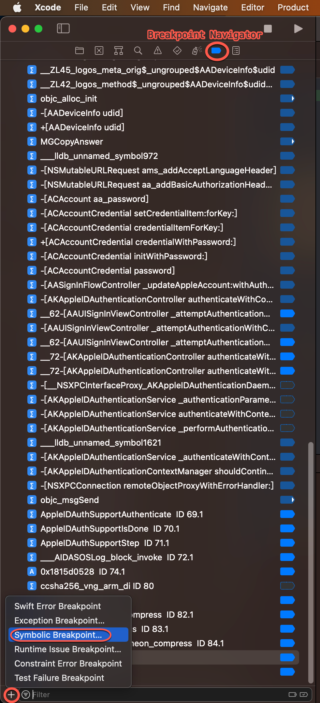
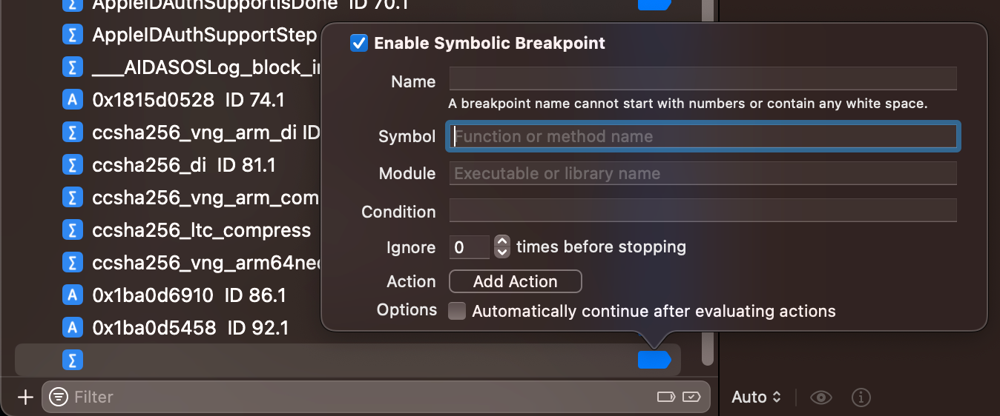
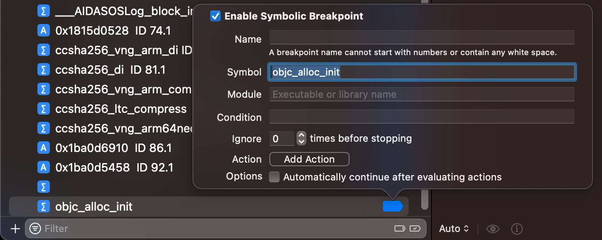
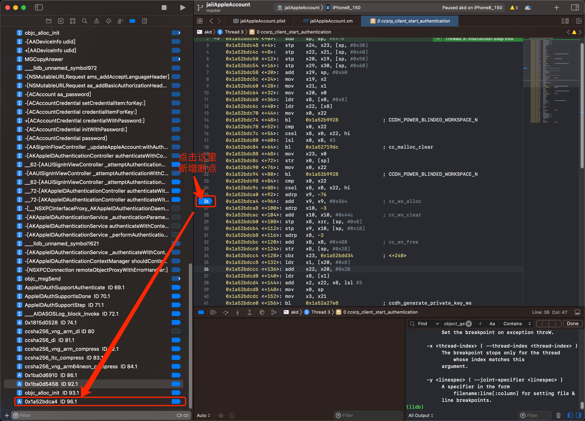
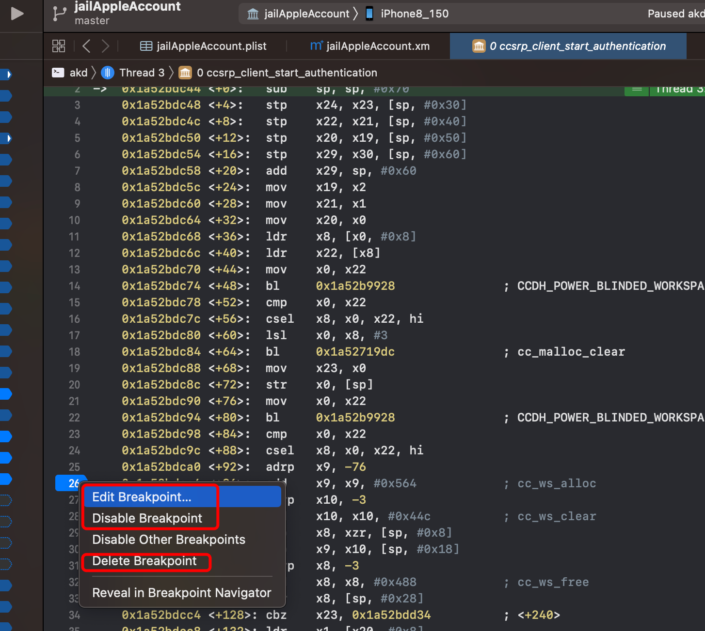

# 普通断点

* 加断点的方式
  * 通过函数名
    * 举例
      * C语言函数
        * `objc_alloc_init`
        * `UIApplicationMain`
        * `awemeMain`
      * iOS的OjbC函数
        * `+[NSString stringWithUTF8String:]`
        * `-[AppDelegate application:didFinishLaunchingWithOptions:]`
        * `-[AWEUserRecommendFollowButton updateWithFollowStatus:followerStatus:preferredTitle:]`
        * `-[AAUISignInController _performAuthenticationForAccount:serviceType:inViewController:completion:]`
  * 通过地址
    * 举例
      * `0x0000000100d5bbb0`
      * `0x1830c6a80`
* 如何加断点
  * Xcode图形界面
    * 通过函数名加断点
      * `Xcode`->`Breakpoint Navigator`->点击`左下角的加号➕`=`Create a breakpoint`->`Symbolic Breakpoint`
        * 
      * 出现`符号断点`的弹框页面
        * 
      * 在`Symbol`中输入对应的函数名，比如`objc_alloc_init`，即可添加完毕普通的函数名的断点
        * 
    * 给 某函数地址=某行汇编代码 加断点
      * 对于调试期间，左键点击Xcode调试界面中，汇编代码的所在行的左边，即可新增断点
        * 
      * 另外，如果需要编辑或删除，右键断点即可操作
        * 
  * lldb命令行
    * 快捷方式添加
      ```bash
      b FunctionName
      b SomeAddress
      ```
      * 举例
        ```bash
        b objc_alloc_init
        b 0x1830c6a80
        ```
    * 完整命令添加
      ```bash
      breakpoint set --name FunctionName
      breakpoint set --address SomeAddress
      ```
      * 常用命令的缩写
        ```bash
        br s -n FunctionName
        br s -a SomeAddress
        ```
      * 举例
      ```bash
      breakpoint set --name objc_alloc_init
      breakpoint set --name "-[NSString stringByAppendingString:]"
      breakpoint set --address 0x1830c6a80
      ```
    * 语法详见：[breakpoint的help语法](../cmd_lldb/br_help.md)
