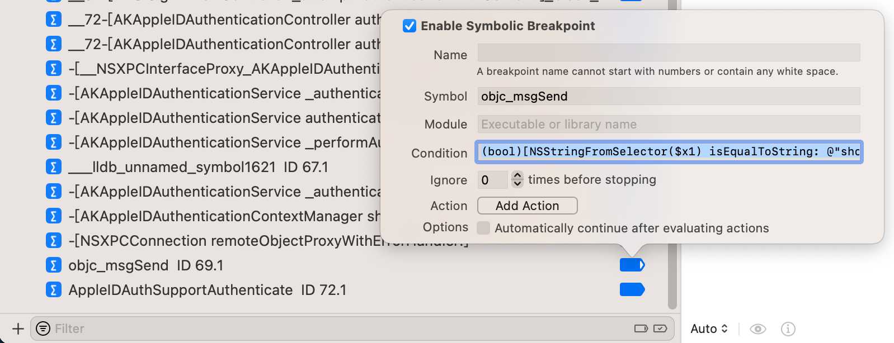
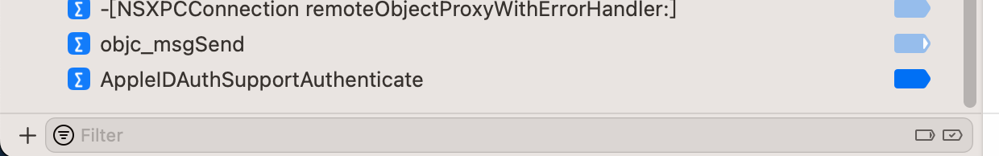

# 导致卡死

* 加了断点，导致程序卡死
  * 之前遇到主要有几种情况
    * （1）断点个数很多
    * （2）（某个或某些断点）被触发的次数很多=被触发的频率很高
    * （2）带条件判断，且判断逻辑很复杂
  * 现象和原因
    * 现象：
      * app卡死，界面操作无反应
      * 或者是卡顿：操作后需要很久（几十秒，甚至几分钟后）才有反应
    * 原因
      * 断点被触发了很多次
      * 且/或每次触发到时，都要执行条件判断
        * 由于逻辑复杂，所以判断逻辑执行起来很耗时，综合下来，就会导致程序运行速度很慢，极其的慢
  * 规避办法
    * （临时）禁用或删除（带复杂逻辑的条件判断的）断点
      * 核心思路：平时用不到时，尽量临时关闭该断点，只有必要时才开启，以减少对程序运行速度的影响
* 举例
  * 举例1：Apple账号登录界面卡死，都无法弹出键盘，导致无法继续输入Apple ID账号
    * 
    * 原因：
      * 之前加了，条件判断的断点，且有2个
        * `objc_alloc_init`
          * `(bool)[NSStringFromClass($x0) isEqualToString: @"AADeviceInfo"]`
        * 某地址(`0x19cbd3c68`)
          * `(bool)[$x0 isKindOfClass: (Class)objc_getClass("AADeviceInfo")]`
      * 导致此处卡死
    * 解决办法
      * [临时禁用](../../note_summary/xcode/deactive_all_br.md)这2个带条件判断的断点
  * 举例2：输入Apple ID账号后点击下一步，界面卡死
    * 
    * 背后原因：
      * 加了objc_msgSend的条件判断的断点
        * 
    * 解决办法：[临时禁用](../../note_summary/xcode/deactive_all_br.md)此条件判断的断点
      * 
  * 举例3：
    * XCode+MonkeyDev调试抖音卡死在登录页：
      * 
      * 原因：
        * 断点太多 + 给一个被调用频率很高的函数（`-[NSString stringByAppendingString:]`）加了断点
      * 解决办法：[临时去掉断点](../../note_summary/xcode/deactive_all_br.md)
        * 等进入抖音主页后，再恢复断点