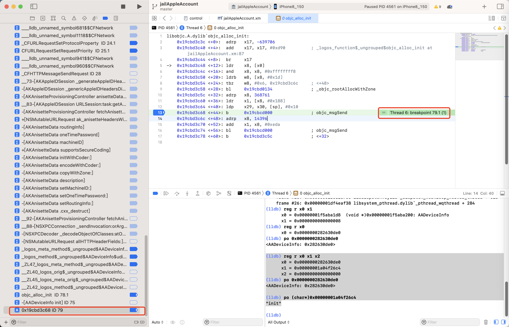

# 断点的条件判断表达式的写法的心得

关于条件判断的断点的表达式写法的心得：

## 要用正确的函数

* 条件判断语句：要用正确的函数
  * 举例
    * `objc_alloc_init`
      * 其定义是
        * `id objc_alloc_init(Class cls)`
      * 传入参数是`Class`（而不是`Instance`）
      * 条件判断的写法
        * 所以只能用，应该用：`NSStringFromClass`
          * 定义：`NSString * NSStringFromClass(Class aClass);`
        * 而不应该用：`isKindOfClass`
          * 定义：是针对`NSObject`的 `- (BOOL)isKindOfClass:(Class)aClass;`
            * 因为此时`$x0`是个`Class`，不是`Instance`=`Object`
      * 所以结论是：objc_alloc_init的断点的条件判断
        * 正确写法：
          ```bash
          (bool)[NSStringFromClass($x0) isEqualToString: @"AADeviceInfo"]
          ```
        * 错误写法：
          ```bash
          (bool)[$x0 isKindOfClass: (Class)objc_getClass("AADeviceInfo")]
          ```
    * `objc_alloc_init`函数中的`+44`行的`objc_msgSend`
      * 背景
        * 代码是
          * `0x19cbd3c68 <+44>: b   0x19cbcd000       ; objc_msgSend`
            * 
        * 此时：`x0`是`AADeviceInfo`的`Instance`=`obj`
      * 条件判断的写法
        * 所以不能用：`NSStringFromClass`
        * 只能用`isKindOfClass`
        * 结论
          * `objc_alloc_init`函数中的`+44`行的`objc_msgSend`的断点的条件判断
            * 正确写法：
              ```bash
              (bool)[$x0 isKindOfClass: (Class)objc_getClass("AADeviceInfo")]
              ```
            * 错误写法：
              ```bash
              (bool)[NSStringFromClass($x0) isEqualToString: @"AADeviceInfo"]
              ```

## 最前面加bool类型转换

* 条件判断语句：往往最前面还要加个布尔类型强制转换（才能起到判断作用）
  * 无效的写法：
    ```bash
    [NSStringFromClass($x0) isEqualToString: @"AADeviceInfo"]
    [$x0 isKindOfClass: (Class)objc_getClass("AADeviceInfo")]
    ```
  * 有效的写法：
    ```bash
    (bool)[NSStringFromClass($x0) isEqualToString: @"AADeviceInfo"]
    (bool)[$x0 isKindOfClass: (Class)objc_getClass("AADeviceInfo")]
    ```

## 借助于lldb确认表达式语法无误

* 条件判断语句：当不确定代码是否正确时，可以借助于lldb命令行的po去执行，看看是否有语法错误

### objc_alloc_init函数的条件判断表达式写法

当，不确定自己的写法，比如：

* objc_alloc_init 的断点的条件判断
  ```bash
  [$x0 isKindOfClass: objc_getClass("AADeviceInfo")]
  ```

是否有误，可以去用`po`试试：

```bash
(lldb) po [$x0 isKindOfClass: objc_getClass("AADeviceInfo")]
error: expression failed to parse:
warning: <user expression 25>:1:2: receiver type 'unsigned long' is not 'id' or interface pointer, consider casting it to 'id'
[$x0 isKindOfClass: objc_getClass("AADeviceInfo")]
 ^~~
error: <user expression 25>:1:21: 'objc_getClass' has unknown return type; cast the call to its declared return type
[$x0 isKindOfClass: objc_getClass("AADeviceInfo")]
```

结果提示有误，意思是不清楚`objc_getClass`返回值的类型

所以后来才去加上`Class`的类型转换的

```bash
(bool)[$x0 isKindOfClass: (Class)objc_getClass("AADeviceInfo")]
```

此处再去执行，至少语法上是对的，不报错了：

```bash
(lldb) po [$x0 isKindOfClass: (Class)objc_getClass("AADeviceInfo")]
 nil
```

所以确定，最后的正确写法是：

```bash
(bool)[$x0 isKindOfClass: (Class)objc_getClass("AADeviceInfo")]
```

### objc_alloc_init的+44行汇编代码的条件判断表达式写法

对于：

```asm
libobjc.A.dylib`objc_alloc_init:
...
->  0x19cbd3c68 <+44>: b      0x19cbcd000              ; objc_msgSend
```

的尝试添加条件判断的断点的过程：

```bash
(lldb) po (int)strcmp(class_getName($x0),"AADeviceInfo")==0
error: expression failed to parse:
error: <user expression 10>:1:13: 'class_getName' has unknown return type; cast the call to its declared return type
(int)strcmp(class_getName($x0),"AADeviceInfo")==0
            ^~~~~~~~~~~~~~~~~~
```

无法识别`class_getName`返回值类型，所以去加上类型转换

```bash
(lldb) po (int)strcmp((const char *)class_getName($x0),"AADeviceInfo")==0
error: Execution was interrupted, reason: EXC_BAD_ACCESS (code=1, address=0x4af7fbe24f30).
The process has been returned to the state before expression evaluation.
```

却又无法执行

```bash
(lldb) po class_getName($x0)
error: Execution was interrupted, reason: EXC_BAD_ACCESS (code=1, address=0x4af7fbe24f30).
The process has been returned to the state before expression evaluation.
```

继续尝试：

```bash
(lldb) po class_getName($x0)
error: Execution was interrupted, reason: EXC_BAD_ACCESS (code=1, address=0x4af7fbe24f30).
The process has been returned to the state before expression evaluation.
```

发现是`class_getName`函数无法正常执行

后来找到定义是：

`const char * class_getName(Class cls);`

-》所以此处是函数用法有误：

`class_getName`参数是`Class`，而此处是`Instance`，所以无法正常运行

换别的函数`object_getClassName`试试

```bash
(lldb) po [object_getClassName($x0) isEqualToString: @"AADeviceInfo"]
error: Execution was interrupted, reason: EXC_BAD_ACCESS (code=1, address=0x665444160).
The process has been returned to the state before expression evaluation.
```

却也无法运行，但另外发现：

```bash
(lldb) po object_getClassName($x0)
0x0000000197633c50
```

`object_getClassName`函数本身，是可以正常运行的

然后找到了定义：

`const char * object_getClassName(id obj);`

发现此处是：返回值是`char *`，而不是`NSString *`

所以要换用`char *`的判断逻辑

```bash
(lldb) po (char *)object_getClassName($x0)
"AADeviceInfo"
```

确保可以输出字符串后，然后换用`strcmp`去对比

```bash
(lldb) po strcmp(object_getClassName($x0),"AADeviceInfo")==0
error: expression failed to parse:
error: <user expression 16>:1:8: 'object_getClassName' has unknown return type; cast the call to its declared return type
strcmp(object_getClassName($x0),"AADeviceInfo")==0
       ^~~~~~~~~~~~~~~~~~~~~~~~
```

仍然报错，所以也要给`object_getClassName`加上返回值类型转换，才可以：

```bash
(lldb) po strcmp((char *)object_getClassName($x0),"AADeviceInfo")==0
error: expression failed to parse:
error: <user expression 17>:1:1: 'strcmp' has unknown return type; cast the call to its declared return type
strcmp((char *)object_getClassName($x0),"AADeviceInfo")==0
^~~~~~~~~~~~~~~~~~~~~~~~~~~~~~~~~~~~~~~~~~~~~~~~~~~~~~~
```

但是又报错`strcmp`返回值类型无法识别

所以也要加上类型转换

```bash
(lldb) po (int)(strcmp((char *)object_getClassName($x0),"AADeviceInfo")==0)
error: expression failed to parse:
error: <user expression 18>:1:7: 'strcmp' has unknown return type; cast the call to its declared return type
(int)(strcmp((char *)object_getClassName($x0),"AADeviceInfo")==0)
      ^~~~~~~~~~~~~~~~~~~~~~~~~~~~~~~~~~~~~~~~~~~~~~~~~~~~~~~
```

发现搞错了，`int`类型转换是需要针对于**strcmp**，而不是**表达式**

```bash
strcmp((char *)object_getClassName($x0),"AADeviceInfo")==0
```

所以int类型转换放在strcmp前面即可：

```bash
(lldb) po (int)strcmp((char *)object_getClassName($x0),"AADeviceInfo")==0
true
```

终于是，通过`po`辅助而确认了此处的断点的条件判断的正确写法是：

```bash
(int)strcmp((char *)object_getClassName($x0),"AADeviceInfo")==0
```
