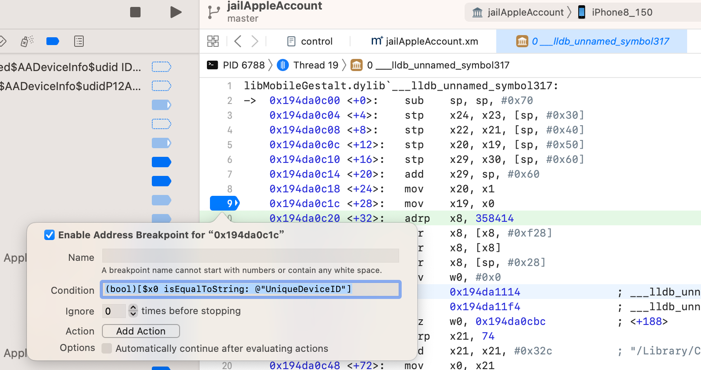

# 函数名和地址逻辑一致

关于断点的条件判断的表达式的，对于：

* Symbol=函数名
* Address=地址=汇编代码地址

的写法上，逻辑是一致的：

* 给函数加带条件判断的断点和给某行汇编加带条件判断的断点，逻辑也是一样的

## 举例

### 函数MGCopyAnswer和___lldb_unnamed_symbol317的某行汇编代码

* 前提
  * 此处都是去判断`x0`寄存器变量的值是否是`UniqueDeviceID`的`NSString`
* 对于
  * 函数：`MGCopyAnswer`
  * 地址=某行汇编代码 = `___lldb_unnamed_symbol317`中的`+28`行的：`0x194da0c1c <+28>:  mov  x19, x0）`
* 加条件判断的断点，都可以用一样的写法：
  ```bash
  (bool)[$x0 isEqualToString: @"UniqueDeviceID"]
  ```
* 效果
  * 函数：`MGCopyAnswer`
    * 
  * 地址=某行汇编代码=`___lldb_unnamed_symbol317`中的`+28`行的：`0x194da0c1c <+28>:  mov  x19, x0）`
    * 
