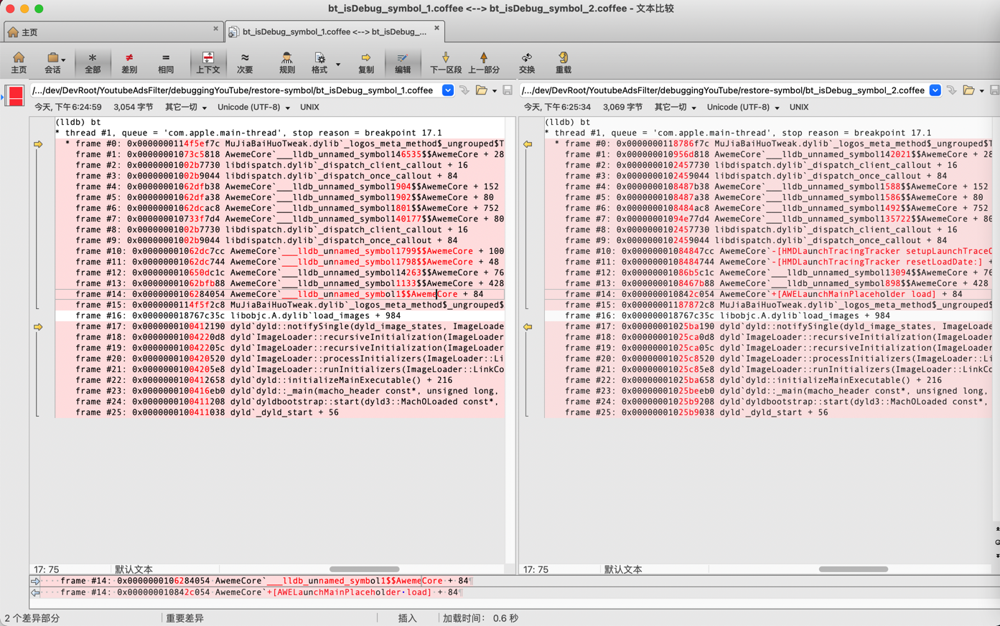

# 恢复符号表

对于之前所介绍的 [lldb无名函数](../../note_summary/lldb_unname/README.md) ，如果有机会，可以去恢复符号表，就可以：

把相关lldb无名函数，变成对应的有名字的函数了。

由此，则就可以：通过函数名去添加断点了。

## 举例

### 抖音的AwemeCore

#### 给抖音的AwemeCore恢复符号表

用[HeiTanBc版本的restore-symbol](https://github.com/HeiTanBc/restore-symbol)去恢复符号表：

具体步骤：

下载、编译、确认：

```bash
git clone --recursive https://github.com/HeiTanBc/restore-symbol.git
cd restore-symbol
make
./restore-symbol
```

使用：

```bash
➜  AwemeCore.framework /Users/crifan/dev/DevSrc/iOS/restore-symbol/HeiTanBc/restore-symbol/restore-symbol AwemeCore_noSymbol -o AwemeCore_restoredSymbol_HeiTanBc
=========== Start =============
Scan OC method in mach-o-file.
Scan OC method finish.
restore 329610 symbols
=========== Finish ============
```

#### 抖音的AwemeCore恢复符号表后的效果

之前通过恢复符号表，把部分AwemeCore的函数，从lldb无名函数：

```bash
frame #10: 0x00000001062dc7cc AwemeCore`___lldb_unnamed_symbol1799$$AwemeCore + 100
frame #11: 0x00000001062dc744 AwemeCore`___lldb_unnamed_symbol1798$$AwemeCore + 48
frame #14: 0x0000000106284054 AwemeCore`___lldb_unnamed_symbol1$$AwemeCore + 84
```

变成了有名字的函数：

```bash
frame #10: 0x00000001084847cc AwemeCore`-[HMDLaunchTracingTracker setupLaunchTraceOnlyOnce] + 100
frame #11: 0x0000000108484744 AwemeCore`-[HMDLaunchTracingTracker resetLoadDate:] + 48
frame #14: 0x000000010842c054 AwemeCore`+[AWELaunchMainPlaceholder load] + 84
```

对比效果：



恢复符号表后的函数调用堆栈：


由此：

* 之前：给函数断点，只能用lldb无名函数`___lldb_unnamed_symbol1$$AwemeCore` 或 计算出实际地址，通过地址去加断点
* 现在：给函数断点，就可以换用对应函数名`+[AWELaunchMainPlaceholder load]`了

