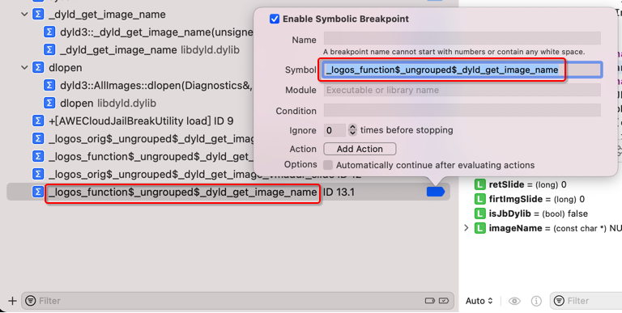

# ObjC函数断点

## 如何搞懂得到正确的ObjC函数名

想要通过函数名给ObjC函数去加断点之前，先要：搞懂ObjC函数名

举例说明：

对于函数：

```objc
@interface AWEUserRecommendFollowButton : AWEUIListCellActionButton <AWEUserRecommendFollowButtonProtocol>
。。。
    - (void)updateWithFollowStatus:(long long)arg1 followerStatus:(long long)arg2 preferredTitle:(id)arg3;
    - (void)updateWithFollowStatus:(long long)arg1 followerStatus:(long long)arg2;
```

想要去写出正确的函数名=可以用于后续Xcode中加断点的ObjC函数名：

* 正确写法

```bash
-[AWEUserRecommendFollowButton updateWithFollowStatus:followerStatus:preferredTitle:]

-[AWEUserRecommendFollowButton updateWithFollowStatus:followerStatus:]
```

* 具体处理过程

去掉函数名，在函数参数往后，其中的类型和变量名

比如：

```objc
- (void)updateWithFollowStatus:(long long)arg1 followerStatus:(long long)arg2;
```

去掉`updateWithFollowStatus`函数的参数往后的的变量类型和变量名，就是：

```objc
updateWithFollowStatus:(long long)arg1 followerStatus:(long long)arg2;
```

->

```objc
updateWithFollowStatus: followerStatus:
```

然后去掉多余的空格：

```objc
updateWithFollowStatus:followerStatus:
```

再去加上前面的类：

* 语法是：
  ```bash
  +或- 中括号 内部是类名
  ```
  * ->
    ```bash
    +/-[ClassNameOrInstanceName xxx]
    ```

逻辑是：

* 对于`Class`=`类`是`➕`=`加号`
* 对于`Instance`=`实例`是`➖`=`减号`

此处是Instance实例，所以是➖减号

```bash
-[AWEUserRecommendFollowButton xxx]
```

* 注意：
  * 加号`➕`或减号`➖`，和后面的`左中括号`=`[`中间，不能有空格
    * 即，下面写法是错误的：
      ```bash
      - [AWEUserRecommendFollowButton xxx]
      ```

最后再去把函数部分加进来，就是：

```objc
-[AWEUserRecommendFollowButton updateWithFollowStatus:followerStatus:]
```

就是正确的，完整的函数名，可以加到Xcode中的断点了。

## 给被hook的函数加断点

对于Logos的hook函数的代码：

* `hook_dyld.xm`
  ```c
  %hookf(const char*, _dyld_get_image_name, uint32_t image_index){
  ...
              const char* imgName = %orig(image_index);
  ```

想要去XCode中加函数的符号断点，则：

* 不是直接加原始函数名：`_dyld_get_image_name`
* 而是要找到Logos的hook后的实际的函数名：
  * `hook_dyld.mm`
    ```c
    __unused static const char* (*_logos_orig$_ungrouped$_dyld_get_image_name)(uint32_t image_index); __unused static const char* _logos_function$_ungrouped$_dyld_get_image_name(uint32_t image_index){
    ...
      _logos_orig$_ungrouped$_dyld_get_image_name(image_index);
    ...
    ```

-> 

* 原函数名：`_dyld_get_image_name`
  * Logos处理后=hook后
    * 原函数变成：`_logos_orig$_ungrouped$_dyld_get_image_name`
    * hook的被替换的函数叫做：`_logos_function$_ungrouped$_dyld_get_image_name`

-> 所以想要去加断点时，应该用：

```bash
_logos_function$_ungrouped$_dyld_get_image_name
```

* Xcode中添加该断点的效果
  * 
