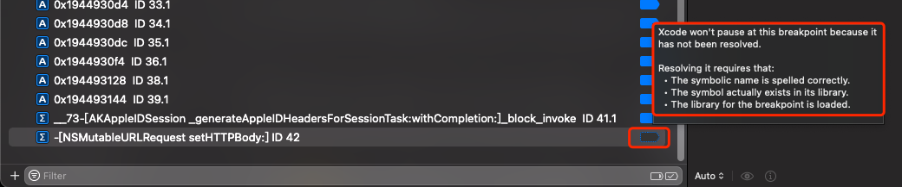
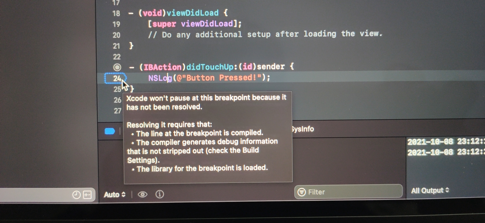

# Xcode中判断断点是否添加成功

Xcode图形界面中，当给普通的`Symbolic Breakpoint`中输入`Symbol`=`符号名`=`函数名`后，Xcode内部会自动去尝试匹配和查找对应符号

所以会出现：

* 有时候，过了几秒后，断点右边的状态显示
  * 不是普通的：成功加上断点的=显示的**底色是实心的蓝色**
  * 而是显示=特殊的，**蓝色的虚线框，底色是空白**（Dark模式时的深色）
    * 如图
      * 
      * 
    * 鼠标移动上去，会有提示
      ```bash
      Xcode won't pause at this breakpoint because it has not been resolved.

      Resolving it requires that:
        The symbolic name is spelled correctly.
        The symbol actually exists in its library.
        The library for the breakpoint is loaded.
      ```
    * 此种状态，就表示
      * `断点没有添加成功`=`断点添加失败`=`断点加不上`=`掉断点`
