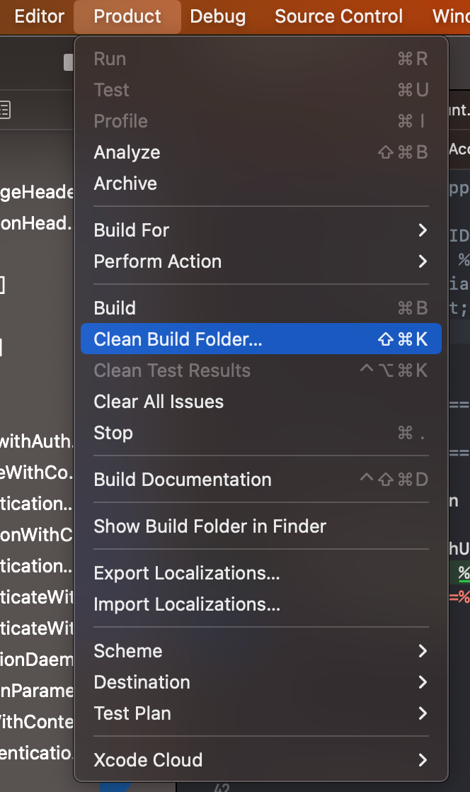
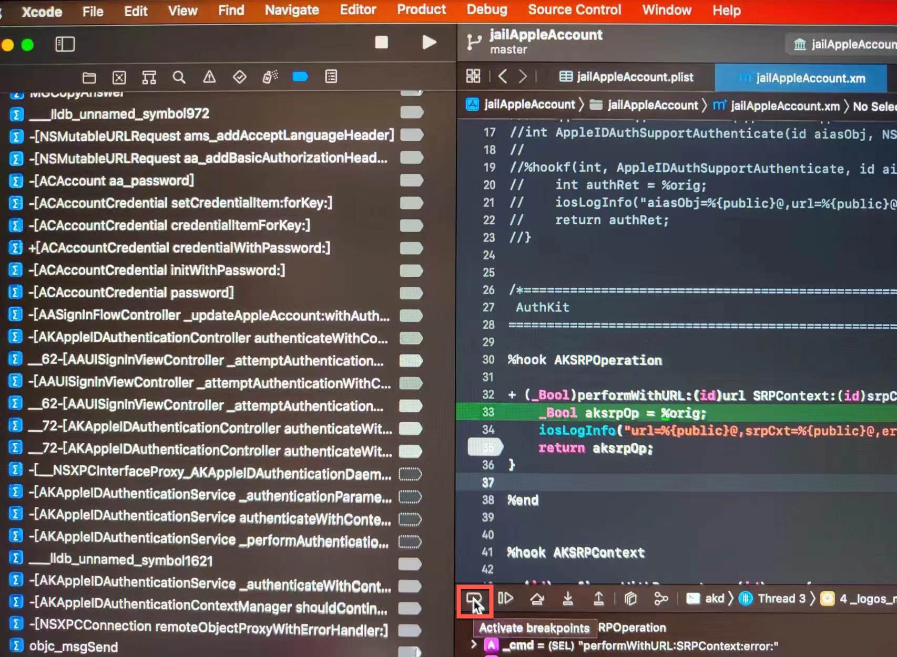

# Xcode中断点加不上

## Xcode中断点加不上的原因

* 一般 **断点添加失败** = **加不上断点** = **断点加不上**，有几种常见的原因
  * `The symbolic name is spelled correctly`=函数名有误
    * 一种是：笔误型的，函数名写错了
      * 举例
        * 把ObjC的加号误写成了减号
          * `+[AKSRPOperation performWithURL:SRPContext:error:]` -> `-[AKSRPOperation performWithURL:SRPContext:error:]`
        * 把ObjC的函数末尾多写个了个冒号`:`
          * `-[__NSCFConstantString stringByAppendingString:]:` -> `-[__NSCFConstantString stringByAppendingString:]`
  * `The symbol not exists in the library`=符号不存在于当前（所有的已加载的）库中
    * 比如
      * ObjC中，调试`ak`d时，函数`-[AKAppleIDAuthenticationContextManager shouldContinueWithAuthenticationResults:error:forContextID:completion:]`加不上断点
        * 原因，该函数其实是存在于另外的二进制=库=app：`Preference`中，需要把调试目标从`akd`改为`Preferences`才行，详见：[断点能加上且能触发](../../note_summary/xcode/added_and_trigger.md)
  * `The library for the breakpoint is not loaded`=符号所在的二进制没有被加载
  * iOS的ObjC的二进制中，本身就没有该函数名=符号，因为二进制中的符号表已经被去掉了

## Xcode中断点加不上的解决办法

对应的，Xcode中，加不上断点时，一些常见的解决办法：

* 原因：iOS的ObjC的二进制中，符号表已经去掉了
  * 举例
    * 抖音
      * 现象：`AwemeCore`中，已经没有符号表了，所以去给函数`-[AWEUserRecommendMutiTagsView followBtnClicked:]`加断点，加不上
        * 
   * `WhatsApp`
      * 现象：`WhatsApp`中，去给函数`-[WARegistrationManager performSameDeviceCheckForSession:updateRegistrationTokenIfNecessary:withCompletion:]`加断点，但加不上
        * 
  * 解决办法：[恢复符号表](../../../note_summary/lldb_unname/restore_symbol.md)
* 原因：Xcode本身有bug
  * 解决办法：清除当前已编译内容
  * 具体步骤：`Xcode`->`Product`->`Clean Build Folder`
    * 注：如果需要，可以多试几次
    * 
* 原因：之前（无辜，不小心）关闭了`调试`
  * 解决办法：（重新）开启调试
  * 具体步骤：`Xcode`->`Product`->`Scheme`->`Edit Scheme`->`Run`->`Info`
    * 把`Build Configuration`设置为`Debug`，且勾选`Debug executable`
      * 
* 原因：之前（不小心）关闭了（临时）所有的断点
  * 此时：如果切换到断点试图，也会看到，所有断点已（从之前的蓝色）变成灰色了 + 鼠标移动上去，会提示：`Active Breakpoints`
    * 
  * 解决办法：点击该（临时关闭或开启所有的断点）按钮，开启所有断点
    * 点击后，所有断点就恢复蓝色了
      * 
* 原因：Debug调试模式下，调试信息被优化掉了
  * 解决办法：恢复Debug调试模式下，不做任何优化
  * 具体步骤：`Xcode`->`PROJECT`->`<YourProjectName>`->`Build Settings`->`Apple Clang`->`Code Generation`->`Optimization Level`->`Debug`设置为`None[-O0]`
    * 注：`None[-O0]`表示`Optimize`=优化为`0`=不做任何额外的优化
      * 
