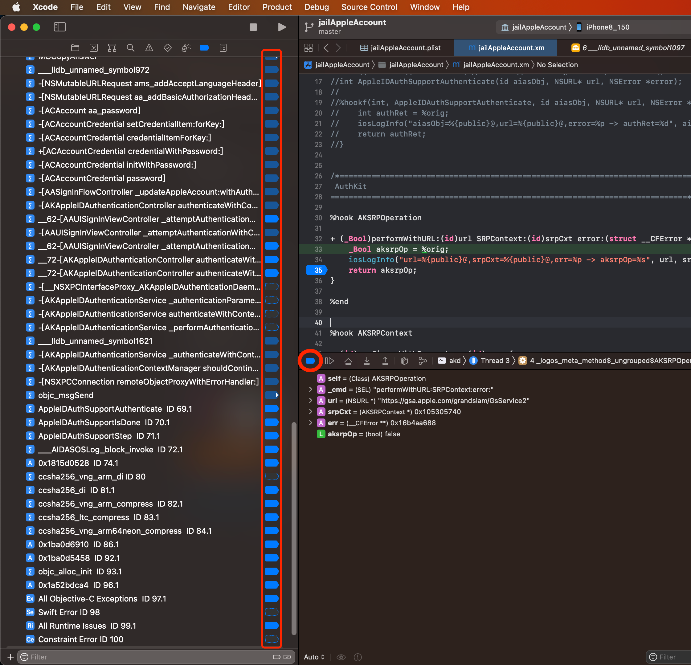
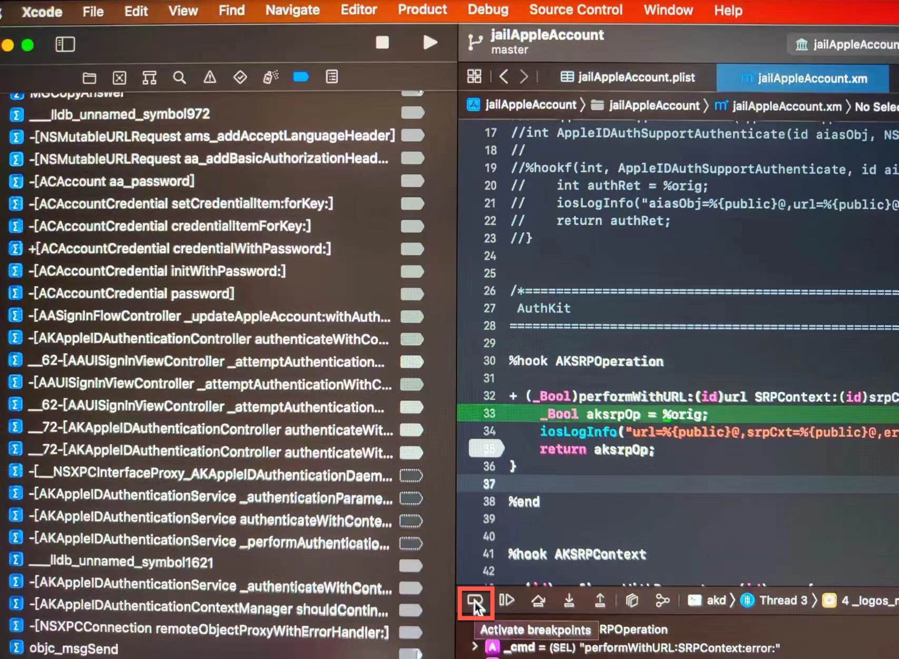
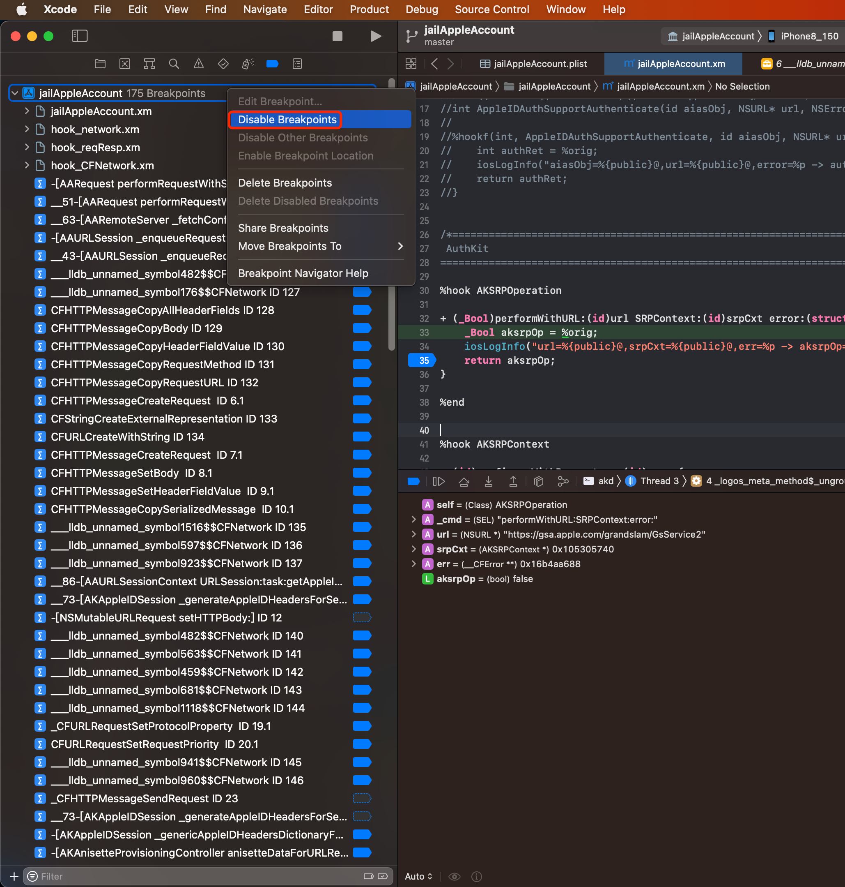
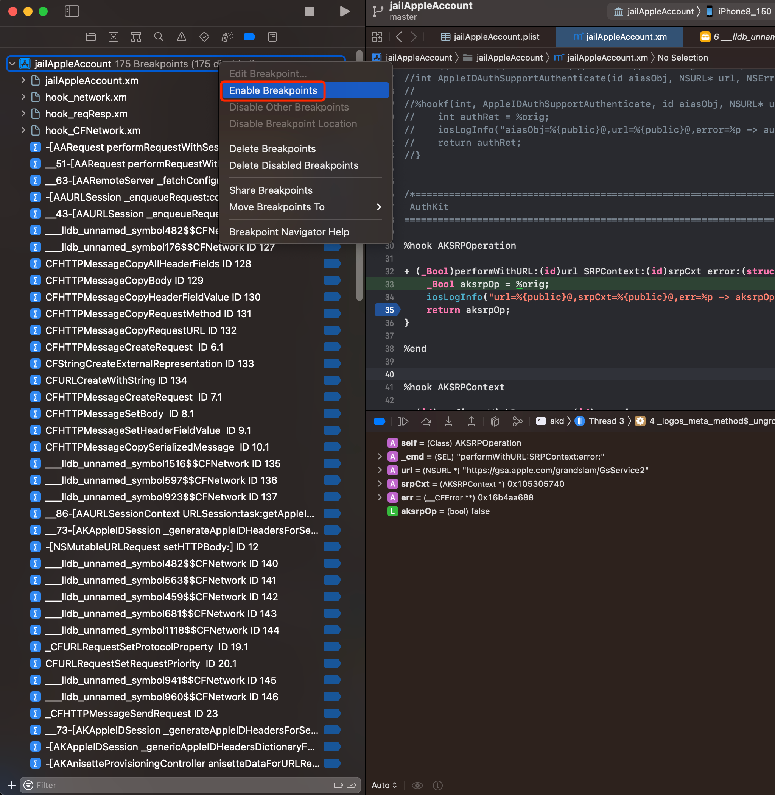

# 临时关闭所有断点

* （一键）临时关闭所有断点 + 后续恢复所有断点
  * 背景：有个需求，调试时，某些时候
    * 比如
      * 希望继续让程序尽快运行，但又不希望已加的多个断点，对程序产生影响
        * 比如
          * 某些会触发多次（设置加了额外判断条件）的断点，会降低程序运行速度，甚至导致程序卡死
    * 所以希望，可以临时的，暂时禁用所有断点，且待会在需要时，可以恢复所有断点
    * 即：临时禁用所有断点（且之后可以恢复被临时禁用的所有断点）
  * 解决办法
    * 推荐方法
      * Xcode中下方的调试控制面板中的：断点控制按钮，点击可以实现
        * 对应的效果
          * `Deactive breakpoints`=临时暂停所有断点（且保留之前的断点的状态）
            * 鼠标移动上去会显示：`Deactive breakpoints`
              * 
          * `Active breakpoints`=激活（重新启用=重新开启）所有断点（且恢复之前的断点的状态）
            * 鼠标移动上去会显示：`Active breakpoints`
              * 
        * 优势是：可以保持之前所有的断点的状态（是激活还是非激活）
    * 凑合用（但效果不够好）的方法
      * Xcode中的`Breakpoint Navigator`->右键对应（正在调试的项目），即可出现右键菜单，支持
        * 关闭或开启所有断点
          * 关闭所有断点=`Disable Breakpoints`
            * 
          * 恢复（开启）所有断点 = `Enable Breakpoints`
            * 
        * 缺点是：是`Disable`/`Enable`，关闭或开启，就：丢失了之前的各个断点的状态
          * 举例：
            * 之前有175个断点，其中只有85个是激活状态，剩余均为未激活，用了`Disable`/`Enable`后，结果全部175个断点就全是激活了（其中激活了很多，想要暂时关闭，但却又不想要删除的，原先是非激活状态的断点）
