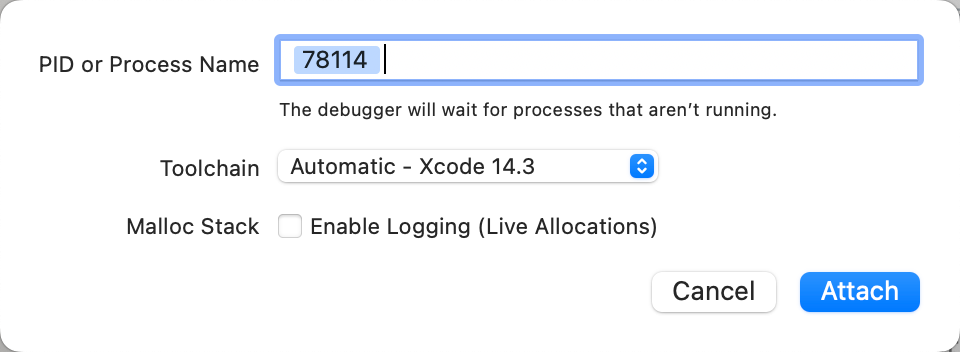

# 如何用Xcode去调试多个函数，且确保断点能触发到

此处经过长期调试，发现一个心得：

* 需求：希望能在一个`Xcode`的项目（`iOSOpenDev`的插件的`Xcode`项目）中，能同时调试多个函数的断点
  * 比如：
    * `objc_alloc_init`：函数断点 + hook代码断点
    * `-[AKAppleIDAuthenticationService _performAuthenticationWithContext:completion:]` ：hook代码断点
    * `__62-[AAUISignInViewController _attemptAuthenticationWithContext:]_block_invoke_2`：函数断点

但是之前调试起来却又发现，会遇到各种问题：

* 有时候是
  * `-[AKAppleIDAuthenticationService _performAuthenticationWithContext:completion:]` ：hook代码断点，能触发
  * 但是 `__62-[AAUISignInViewController _attemptAuthenticationWithContext:]_block_invoke_2`：函数断点 无法触发
* 有时候却又是
  * `__62-[AAUISignInViewController _attemptAuthenticationWithContext:]_block_invoke_2`：函数断点，能触发
  * 但是 `-[AKAppleIDAuthenticationService _performAuthenticationWithContext:completion:]` ：hook代码断点，无法触发

等等各种奇怪、特殊的现象

最后经过总结发现：

* 经验心得：Xcode中确保断点能加上且能触发

后，基本上确认：

其核心有2个：

* 能搞清楚：该函数所被触发的目标
  * 确保Xcode的调试目标是：该函数所被触发的目标

但是实际上，往往却：

很难搞清楚 某函数 真正被触发 所属的目标

所以此时的心得就是：

* （1）给`Xcode`的（`iOSOpenDev`插件）的hook目标，多加上几个目标
  * 目的：基本上能确保覆盖到被调试的多个函数，所涉及到的不同的目标
  * 效果：
    * 
      * 包括了：
        * `Executable`=`二进制`的：`akd`、`amsaccountsd`
        * `Bundle`=`app`的：`com.apple.Preferences`
* （2）`Xcode`调试时：如果断点（没加上或）没触发，及时去试试，**换其他调试目标**-》往往就可以触发断点了
  * 比如
    * `-[AKAppleIDAuthenticationService _performAuthenticationWithContext:completion:]` ：hook代码断点，没触发 时
      * `Xcode`调试目标从 `Preferences` 换 `akd`
        * 
    * `__62-[AAUISignInViewController _attemptAuthenticationWithContext:]_block_invoke_2`： 函数断点，没触发 时
      * Xcode调试目标从 `akd` 换 `Preferences`
        * 
          * 此处`78114`是`Preferences`的`PID`
