# Xcode中确保断点能加上且能触发

此处整理经验心得：Xcode中确保断点能加上且能触发

* 暂且不包括（debugserver+lldb中）`lldb`加断点的情况，只考虑Xcode调试期间的断点相关情况

先介绍背景：

* Xcode中断点类型
  * Xcode通过函数名加断点=函数名的断点
  * Xcode中的插件hook代码的断点=hook代码的断点

再介绍具体心得：

* Xcode中确保断点能加上且能触发
  * 概述
    * 函数名的断点
      * 加不上断点
        * 原因
          * 所属二进制中不存在该symbol符号
            * 解决办法：调试找出底层函数（lldb无名函数），给底层函数加断点
      * 能加上断点，但没触发
        * 原因
          * Xcode调试的目标 不是 函数所属的被调用的目标
            * 解决办法： 确保Xcode调试目标 是=等于 函数被调用的所属目标
    * hook代码的断点
      * 加不上断点
        * 原因
          * 加了hook代码的dylib的最新插件没被加载
            * 解决办法：确保最新的dylib被加载
          * 函数被触发的目标 和 Xcode调试目标 不一致
            * 解决办法：确保函数被触发目标和Xcode调试目标一致
              * 具体办法：把Xcode调试目标改为函数被触发的目标
      * 能加上断点，但没触发
        * 原因
          * 函数名搞错了
            * 解决办法：使用正确的函数
          * hook目标和Xcode调试目标都不对
            * 解决办法：把hook的目标 和 Xcode调试目标，都改为：函数被触发的目标

* 详解
  * 函数名的断点
    * 加不上断点
      * 可能原因
        * 所属二进制中不存在该symbol符号
          * 举例
            * `-[AKAppleIDAuthenticationService _authenticateWithContext:completion:]`
              * 现象
                * 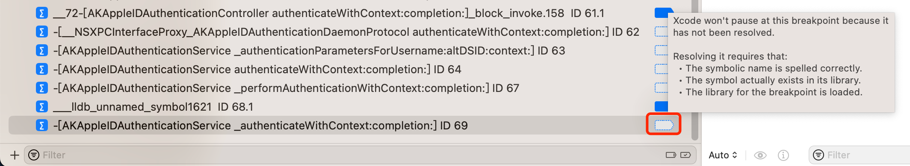
              * 如何验证：image lookup找不到该函数
                ```bash
                (lldb) image lookup -vn "-[AKAppleIDAuthenticationService _authenticateWithContext:completion:]"
                (lldb)
                ```
              * 解决办法：经调试，找到底层真正的函数，此处的lldb的无名的函数：`akd`的`___lldb_unnamed_symbol1621`，给此lldb无名函数加断点
                * 写法
                  * `Symbol`: `___lldb_unnamed_symbol1621`
                  * `Module`: `akd`
                * 效果
                  * 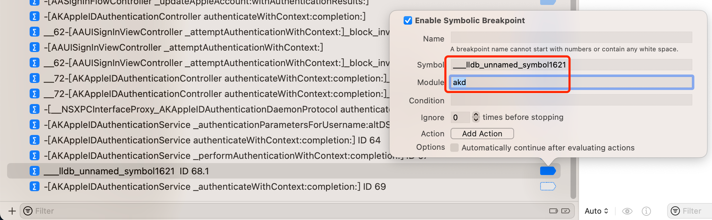
    * 能加上断点，但没触发
      * 可能原因
        * Xcode调试的目标 不是 函数所属的被调用的目标
          * 举例
            * `__62-[AAUISignInViewController _attemptAuthenticationWithContext:]_block_invoke_2`
              * 现象
                * 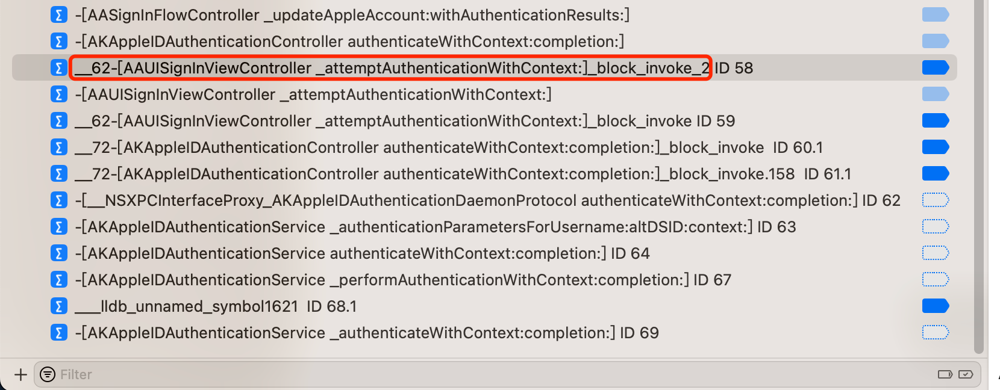
                * 细节：
                  * Xcode调用的目标：`akd`
                  * 函数（`__62-[AAUISignInViewController _attemptAuthenticationWithContext:]_block_invoke_2`）被调用的所属目标：`Preferences`
              * 解决办法
                * 确保Xcode调试目标 是 函数被调用的所属目标 -》 此处都是：`Preferences`
                  * 具体步骤：让Xcode调试`Preferences`（而不是akd）
                    * 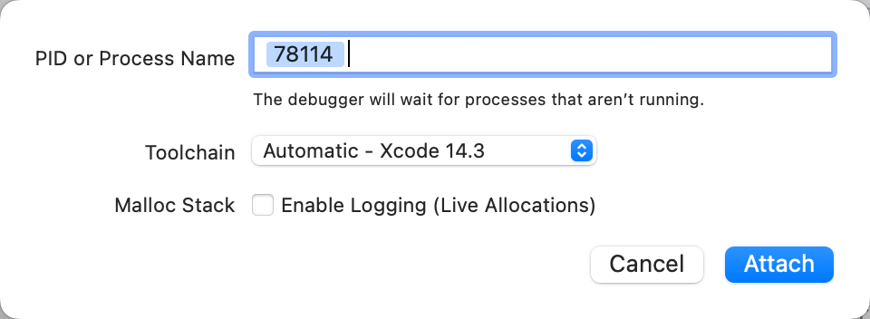
                      * 此处的`78114`是`Preferences`的`PID`
  * hook代码的断点
    * 加不上断点
      * 可能原因
        * 加了hook代码的dylib的最新插件没被加载
          * 举例
            * `-[NSXPCConnection remoteObjectProxyWithErrorHandler:]`
              * 现象：
                * 
                  * 注：`86215`是`Preferences`的`PID`
                * 此时：Xcode调试目标=被hook目标：`Preferences`
              * 原因：包含了新版的hook代码的dylib并没有被加载
                * 细节：此处Xcode中iOSOpenDev的dylib插件，编译安装后，虽然`Respring`=重启桌面，但是其实`Preferences`=`设置`app，并没有重启，导致包含了新版的hook代码的dylib并没有被加载
              * 解决办法：重启此处被hook目标`Preferences`
              * 具体步骤：杀掉`Preferences`，重启`Preferences`
                * 确保：最新的dylib被加载
                  * 详见：[背景知识](../common_logic/background.md)
        * 函数被触发的目标 和 Xcode调试目标 不一致
          * 举例
            * `objc_alloc_init`
              * 现象
                * 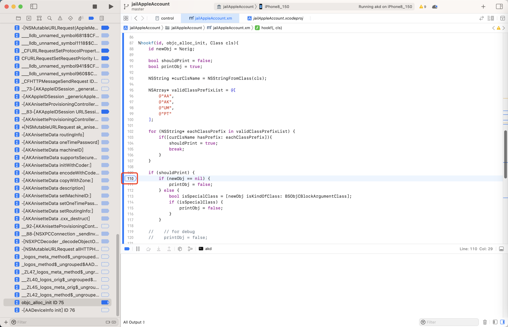
              * 细节
                * 函数objc_alloc_init被触发的目标是：`Preferences`
                * Xcode调试的目标：`akd`
              * 解决办法：
                * 确保Xcode调试目标 和 函数被触发目标 一致，此处都是`Preferences`
                  * 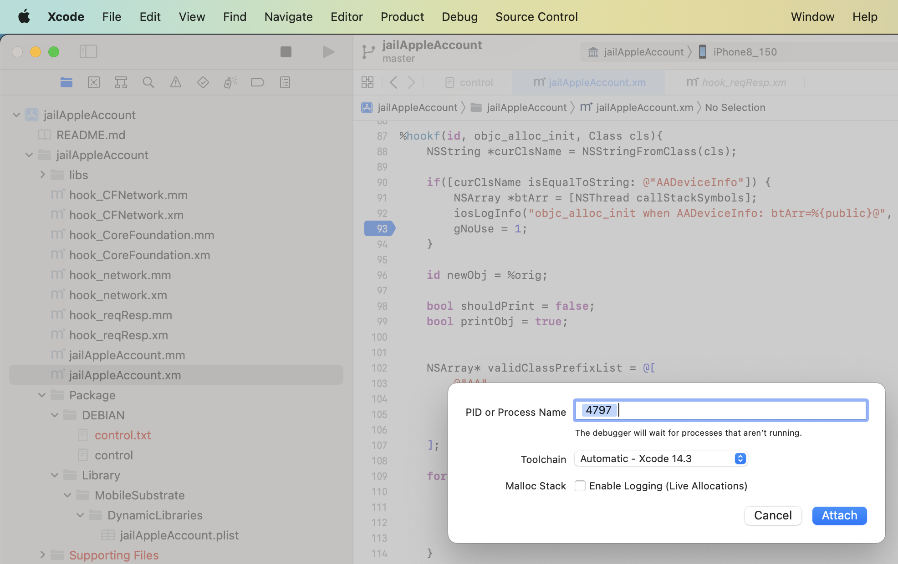
                    * 注：此处`4797`是`Preferences`的`PID`
            * `-[AKAppleIDAuthenticationContextManager shouldContinueWithAuthenticationResults:error:forContextID:completion:]`
              * 现象
                * 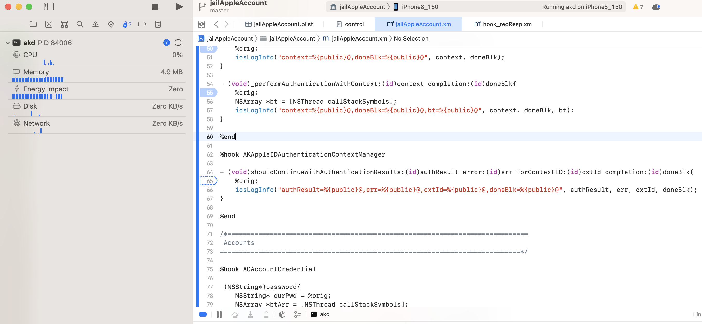
              * 细节：
                * Xcode调试目标：`akd`
                * 函数被调用到的目标：`Preferences`
              * 解决办法：
                * 改Xcode调试目标为`Preferences`
                  * 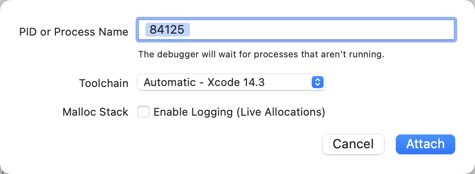
                    * 注：此时`Preferences`的`PID`是84125
                * 效果：即可
                  * 能加上hook函数的断点
                    * 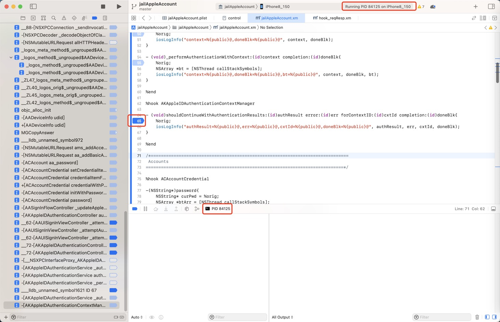
                  * 且hook函数的断点可以触发
                    * 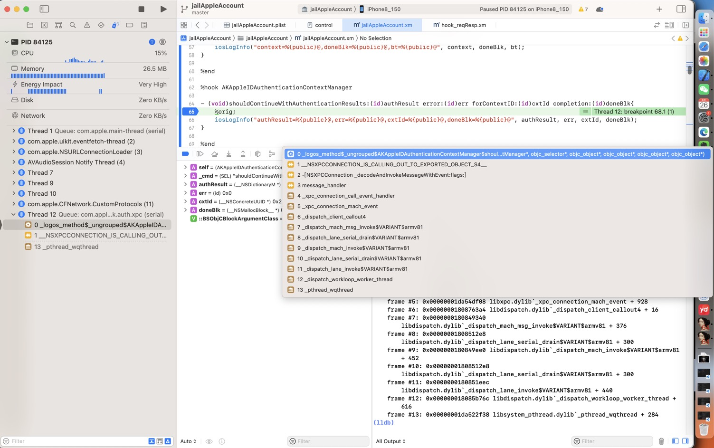
    * 能加上断点，但没触发
      * 可能原因
        * 函数名搞错了
          * 举例
            * `-[AKAppleIDAuthenticationService _authenticationParametersForUsername:altDSID:context:]`
              * 现象
                * 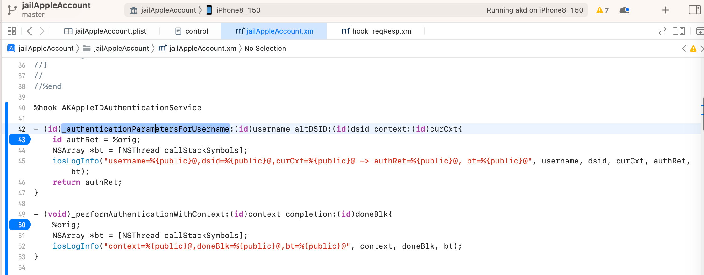
              * 原因
                * 调试期间，看错函数名了，误把
                  * `-[AKAppleIDAuthenticationService _authenticateWithContext:completion:]`
                * 看错成：
                  * `-[AKAppleIDAuthenticationService _authenticationParametersForUsername:altDSID:context:]`
              * 解决办法：
                * 改为此处正确的函数：
                  * `-[AKAppleIDAuthenticationService _authenticateWithContext:completion:]`
                * 去加hook代码，加断点
                  * 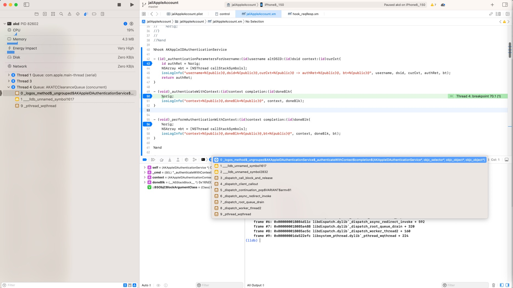
                * -》最后就可以正常触发hook代码的断点了
        * hook目标和Xcode调试目标都不对
          * 举例
            * `-[AKAppleIDAuthenticationService _performAuthenticationWithContext:completion:] `
              * 现象
                * 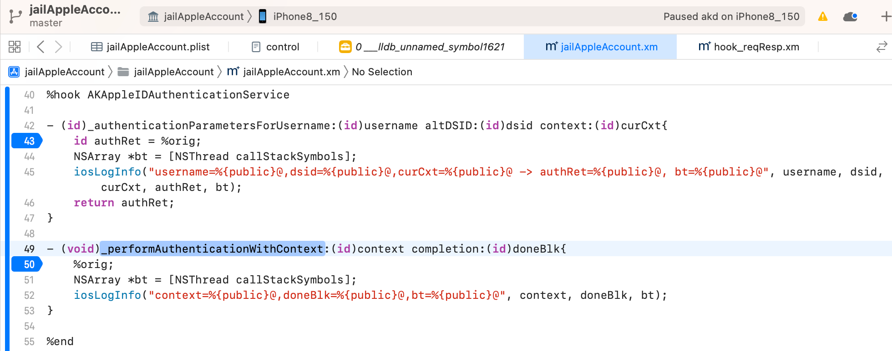
                * 细节：函数 `-[AKAppleIDAuthenticationService _performAuthenticationWithContext:completion:]` 是在`akd``（AuthKit`的daemon程序）中被触发的
              * 此时的
                * hook目标是：`Preferences`
                * Xcode调试目标：`Preferences`
              * 解决办法
                * 把hook目标改为：`akd`
                  * 注：`iOSOpenDev`中的插件，可以加多个hook目标，所以此处：额外再加上akd即可
                    * 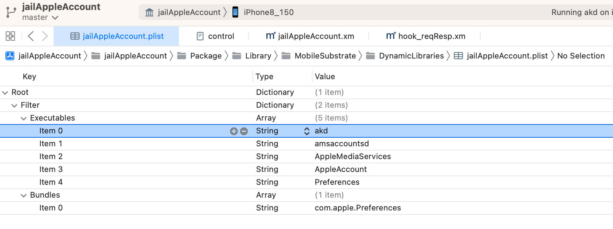
                * 把Xcode调试目标改为：`akd`
                  * 
