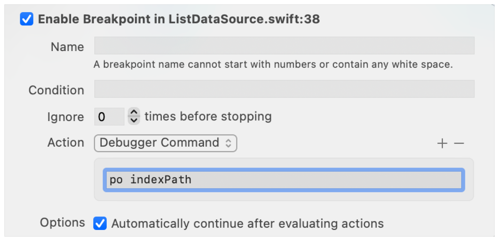
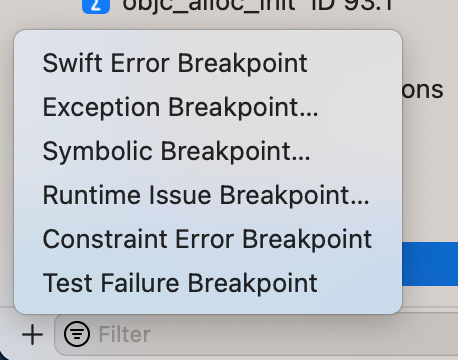
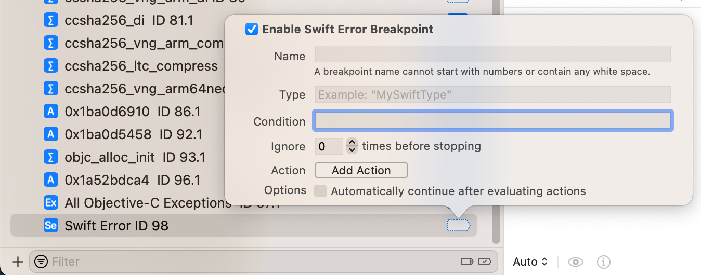
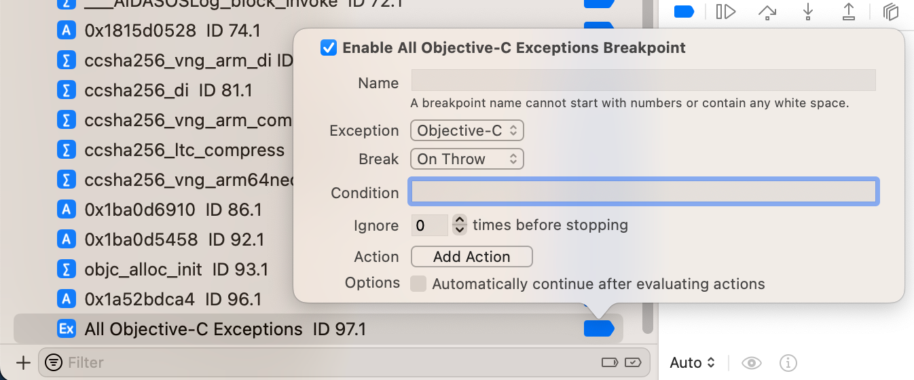
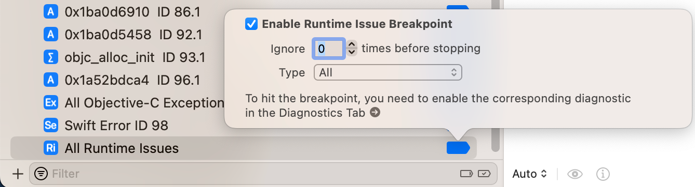
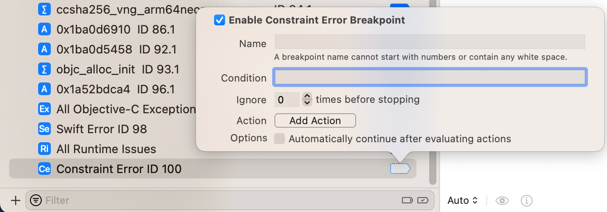
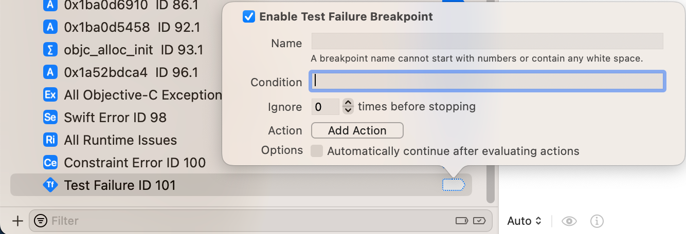

# Xcode图形界面中的断点

* Xcode特有的
  * 当断点发生时，支持更多的设置
    * ignore
      * 忽略几次之后，再触发断点
    * action
      * 当触发断点时，执行额外某些动作
        * 举例
          * 触发某个音乐文件，比如响铃一声之类的
          * Action=`Debug Command`为`po indexPath`去打印当前索引值
            * 
  * 全局的异常类的断点
    * Xcode中，新增断点时，可以看到其他更多选项
      * 
    * 包括
      * `Swift Error Breakpoint`
        * 含义：当有`Swift`代码方面的错误，会触发断点
        * 
      * `Exception Breakpoint`=`Objective-C Exceptions Breakpoint`
        * 含义：当有`Objective-C`方面的异常，会触发断点
        * 
      * `Runtime Issue Breakpoint`
        * 含义：当有`Objective-C`的运行时（Runtime）方面的问题，会触发断点
        * 
      * `Constraint Error Breakpoint`
        * 含义：当有（比如iOS中布局等方面的）限制（不满足）方面的错误时，触发异常？
        * 
      * `Test Failure Breakpoint`
        * 含义：当项目代码中有测试代码时，且运行时测试代码运行发现条件不满足，测试失败时，触发断点
        * 
